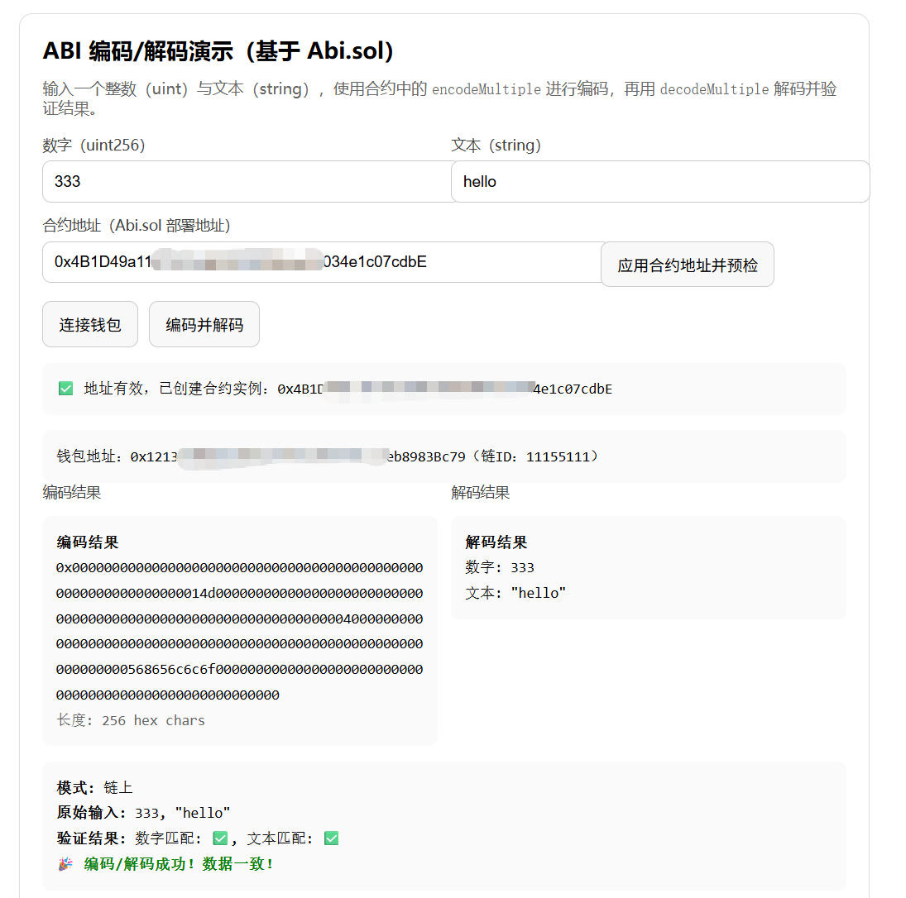

# ABI 编码/解码演示（Abi.sol + ethers v6）

使用合约纯函数进行 ABI 编码与解码，并在链上调用失败时自动回退到离线模式。页面已支持钱包地址显示、合约地址输入与链上预检、编码/解码双结果框展示与舒适的行间距。

## 功能特点
- 链上/离线双模式：优先调用合约纯函数；失败时自动使用 `ethers.AbiCoder` 离线编码/解码。

- 合约地址输入与预检：输入部署地址，点击“应用并预检”，会使用 `getCode` 检查该地址是否有合约代码。

- 钱包连接与信息显示：连接后展示“钱包地址”和“链 ID”。

- 编码/解码分区展示：
  - 左侧“编码结果”显示 hex 数据与长度。
  - 右侧“解码结果”显示数字与文本。
  
- 友好错误提示：当链上返回空数据（`0x`）或 ABI 不匹配时，给出明确排查方向。

  

## 目录结构
```
abi/
├── Abi.sol               # 演示用合约：纯函数进行 ABI 编码/解码
├── ethers.umd.min.js     # Ethers v6 UMD 构建
├── index.html            # 教学页面（UI + 交互）
└── index.js              # 逻辑脚本（钱包连接、预检、链上/离线双模式）
```

## 环境要求
- 浏览器钱包：MetaMask（或其他 EIP-1193 兼容钱包）
- Node.js：`>= 18`
- 本地静态服务器（用于注入钱包对象）：推荐 `serve`

## 快速开始
1. 在项目根目录启动静态服务器：
   - `npx --yes serve -l 5500 ./abi`
2. 打开页面：
   - `http://localhost:5500/index.html`

> 注意：直接用浏览器打开本地文件（file://）通常无法注入钱包对象，建议使用本地服务器方式访问。

## 使用说明（课堂演示建议）
1. 连接钱包
   - 点击“连接钱包”，页面将显示“钱包地址”和当前“链 ID”。
2. 应用合约地址并预检
   - 在“合约地址（Abi.sol 部署地址）”输入框中填入你部署的 `Abi.sol` 合约地址。
   - 点击“应用合约地址并预检”，页面会使用 `provider.getCode(address)` 检查链上是否存在合约代码。
   - 若成功，会提示“✅ 地址有效，已创建合约实例：...”。
3. 编码并解码
   - 输入一个整数（`uint256`）和字符串（`string`）。
   - 点击“编码并解码”。
   - 若链上调用成功，显示“模式：链上”；否则自动回退为“模式：离线”。
   - 左右两个结果框分别显示编码与解码结果；摘要区域显示原始输入与匹配校验。

## 合约接口（Abi.sol）
- `encodeMultiple(uint256 num, string text) -> bytes`
- `decodeMultiple(bytes data) -> (uint256, string)`
- `encodeUint(uint256 value) -> bytes`
- `decodeUint(bytes data) -> uint256`

所有函数均为 `pure`，不修改链上状态

## 原理简述
- ABI 编码：将高层语言的参数（如 `uint256`、`string`）打包成十六进制字节数据（`0x...`）。
- ABI 解码：将字节数据按类型还原为对应的值。
- 链上调用：通过 `ethers.Contract` 调用合约的纯函数获得编码/解码结果。
- 离线模式：使用 `ethers.AbiCoder.defaultAbiCoder()` 在本地进行编码/解码，无需链上合约。

## 常见问题与排查
- 报错：`could not decode result data (value="0x")`
  - 原因：链上返回空数据，常见于地址错误、网络不一致或 ABI 不匹配。
  - 排查：
    - 确认合约地址为你的 `Abi.sol` 部署地址。
    - 确认钱包连接的链与部署网络一致（页面已显示链 ID）。
    - 确认页面中的 ABI 与实际合约函数签名一致。
    - 预检：`provider.getCode(address)` 返回 `0x` 表示该地址无合约代码。


