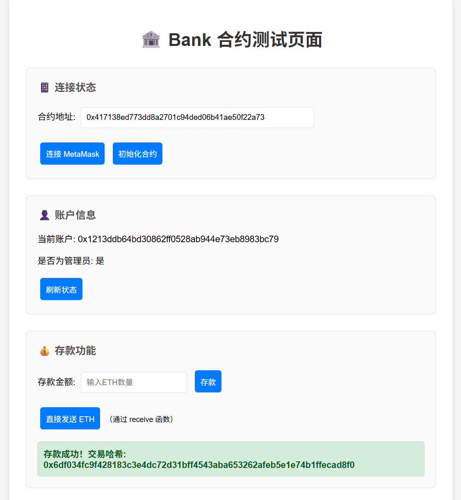
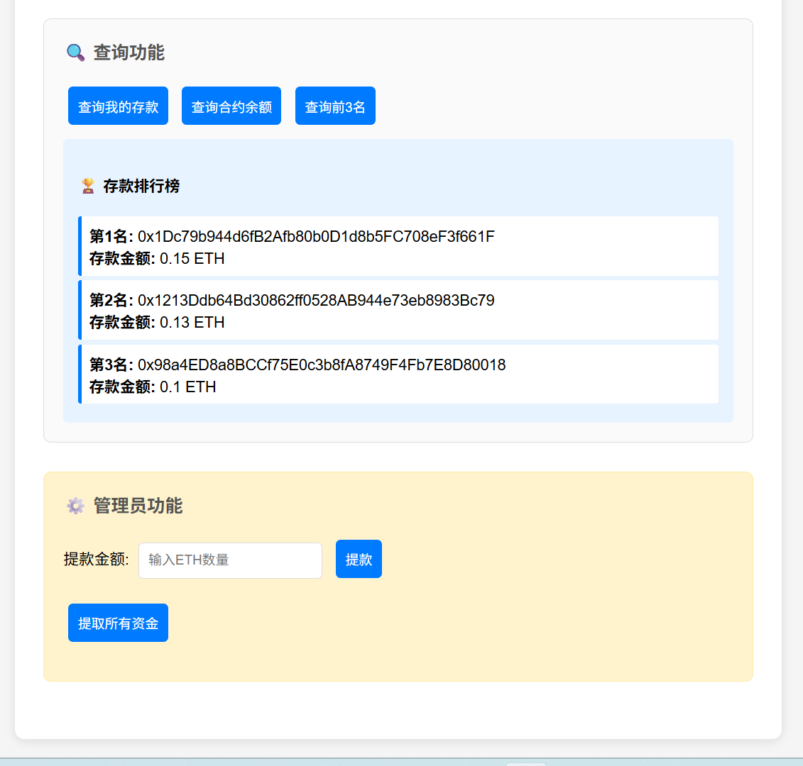

# Bank 合约

这是一个基于 Solidity 的银行合约，实现了存款、提款和排行榜功能。

## 功能特性

1. **直接存款**：用户可以通过 Metamask 等钱包直接向合约地址发送以太币进行存款
2. **存款记录**：合约记录每个地址的存款金额
3. **管理员提款**：只有管理员可以通过 `withdraw()` 方法提取资金
4. **存款排行榜**：用数组记录存款金额前 3 名用户






## 合约结构

### 状态变量
- `admin`: 合约管理员地址
- `deposits`: 映射每个地址的存款金额
- `topDepositors`: 存款金额前3名用户的地址数组
- `depositors`: 所有存款用户的地址列表

### 主要函数

#### 存款相关
- `receive()`: 接收以太币的回退函数
- `deposit()`: 存款函数
- `getDeposit(address)`: 查询指定地址的存款金额

#### 提款相关（仅管理员）
- `withdraw(uint256)`: 提取指定金额
- `withdrawAll()`: 提取所有资金

#### 查询函数
- `getContractBalance()`: 获取合约余额
- `getTopDepositors()`: 获取前3名存款用户地址
- `getTopDepositorsWithAmounts()`: 获取前3名用户及其存款金额
- `getDepositorsCount()`: 获取存款用户总数

#### 管理函数
- `transferAdmin(address)`: 转移管理员权限

## 使用方法

### 1. 部署合约
使用 Remix IDE 或其他开发工具部署 `Bank.sol` 合约。

### 2. 存款
用户可以通过以下方式存款：
- 直接向合约地址发送以太币
- 调用 `deposit()` 函数并附带以太币

### 3. 管理员操作
合约部署者自动成为管理员，可以：
- 提取合约中的资金
- 转移管理员权限

## 事件

- `Deposit(address indexed depositor, uint256 amount)`: 存款事件
- `Withdrawal(address indexed admin, uint256 amount)`: 提款事件
- `TopDepositorsUpdated(address[3] topDepositors)`: 前3名更新事件

## 安全特性

1. **访问控制**：只有管理员可以提取资金
2. **输入验证**：存款和提款金额必须大于0
3. **余额检查**：提款前检查合约余额是否充足
4. **重入保护**：使用 `transfer()` 函数避免重入攻击

## 部署说明

1. 确保使用 Solidity 版本 ^0.8.0
2. 部署时无需构造函数参数
3. 部署者自动成为合约管理员

## 示例交互

```javascript
// 存款（通过 MetaMask）
// 直接向合约地址发送 ETH

// 查询自己的存款
const myDeposit = await bank.getDeposit(userAddress);

// 查询前3名存款用户
const [topUsers, amounts] = await bank.getTopDepositorsWithAmounts();

// 管理员提款
await bank.withdraw(ethers.utils.parseEther("1.0"));
```

## 合约说明

1. 合约部署后，部署者成为管理员
2. 前3名排行榜会在每次存款后自动更新
3. 提款操作只能由管理员执行
4. 存款金额记录是累计的，不会因提款而减少