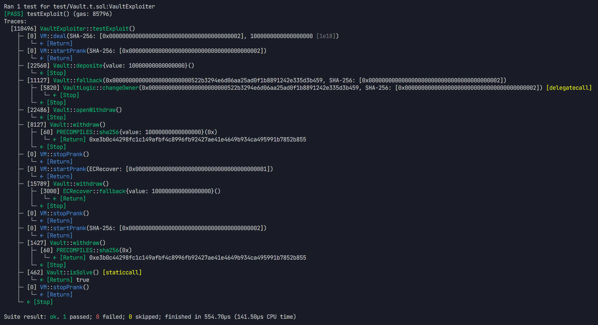
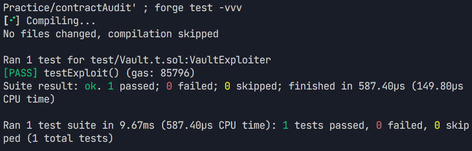

# Contract Audit - Vault 合约安全审计

这是一个智能合约安全审计项目，专门用于演示和学习 Solidity 合约中的 delegatecall 存储槽冲突漏洞。

## 项目概述

本项目包含一个存在安全漏洞的 Vault 合约系统，以及相应的攻击测试用例。通过这个项目，可以学习到：

- delegatecall 的工作原理和潜在风险
- 存储槽冲突漏洞的成因和利用方式
- 如何编写安全审计测试用例
- Foundry 测试框架的使用

## 合约架构

### VaultLogic 合约
- 负责管理 owner 权限变更逻辑
- 包含密码验证机制
- 存储布局：
  - slot 0: `address public owner`
  - slot 1: `bytes32 private password`

### Vault 合约
- 主要的资金存储合约
- 通过 delegatecall 调用 VaultLogic
- 存储布局：
  - slot 0: `address public owner`
  - slot 1: `VaultLogic logic`
  - slot 2: `mapping (address => uint) deposites`
  - slot 3: `bool public canWithdraw`

## 安全漏洞分析

### 漏洞类型：delegatecall 存储槽冲突

**漏洞原理：**
1. VaultLogic 和 Vault 合约的存储布局不匹配
2. VaultLogic 的 `password` (slot 1) 对应 Vault 的 `logic` 变量 (slot 1)
3. 攻击者可以传入 logic 合约地址作为密码来绕过验证
4. 成功调用 `changeOwner` 函数获取合约控制权

**攻击步骤：**
1. 存入少量资金获得提取权限
2. 通过 fallback 函数调用 `changeOwner`，传入 logic 合约地址作为密码
3. 成功修改 owner 为攻击者地址
4. 调用 `openWithdraw()` 开启提取功能
5. 调用 `withdraw()` 提取所有资金




## 📊 从测试输出中可以看到

### 🎯 测试执行流程：

```
[PASS] testExploit() (gas: 85796)
```

- 测试通过
- 总 gas 消耗：85,796

### 🔍 详细执行轨迹：

1. **存入资金 ：**

   

```
├─ [22560] Vault::deposite{value: 10000000000000000}()
│   └─ ← [Stop]
```

- 调用 deposite 函数，存入 0.01 ETH
- Gas 消耗：22,560

2. **执行攻击 ：**

```
├─ [11127] Vault::fallback(changeOwner函数调用数据)
│   ├─ [5820] VaultLogic::changeOwner(...) [delegatecall]
│   │   └─ ← [Stop]
│   └─ ← [Stop]
```

- 触发 fallback 函数
- 通过 delegatecall 调用 VaultLogic::changeOwner
- 成功修改了 Vault 的 owner

3. **开启提款 ：**

```
├─ [22486] Vault::openWithdraw()
│   └─ ← [Stop]
```

- 调用 openWithdraw ，现在攻击者是 owner 了

4. **提取资金 ：**

```
├─ [8127] Vault::withdraw()  // 攻击者提取自己的资金
├─ [15789] Vault::withdraw() // 提取原 owner 的资金  
├─ [1427] Vault::withdraw()  // 再次提取
```

5. **验证攻击成功 ：**

```
├─ [462] Vault::isSolve() [staticcall]
│   └─ ← [Return] true
```

- 合约余额为 0，攻击成功


## 项目结构

```
contractAudit/
├── src/
│   └── Vault.sol          # 存在漏洞的合约代码
├── test/
│   └── Vault.t.sol        # 攻击测试用例
├── script/                # 部署脚本目录
├── lib/                   # 依赖库
└── README.md             # 项目文档
```

## 环境要求

- [Foundry](https://book.getfoundry.sh/getting-started/installation)
- Solidity ^0.8.25

## 快速开始

### 1. 安装依赖

```bash
forge install
```

### 2. 编译合约

```bash
forge build
```

### 3. 运行测试

```bash
# 运行所有测试
forge test

# 运行详细测试输出
forge test -vvv

# 运行特定测试
forge test --match-test testExploit
```




### 4. 查看测试覆盖率

```bash
forge coverage
```

## 测试说明

### VaultExploiter 测试合约

- `setUp()`: 初始化测试环境，部署合约并存入初始资金
- `testExploit()`: 实现完整的攻击流程，验证漏洞利用

**测试成功标准：**
- 合约余额归零 (`vault.isSolve()` 返回 `true`)
- 攻击者成功提取所有资金

## 安全建议

### 如何修复此漏洞：

1. **统一存储布局**：确保 delegatecall 的目标合约与调用合约有相同的存储布局
2. **使用接口**：通过接口定义明确的函数签名和存储结构
3. **避免 delegatecall**：除非必要，尽量使用普通的 call 而不是 delegatecall
4. **存储隔离**：将逻辑合约的状态变量与主合约分离

### 最佳实践：

```solidity
// 推荐的安全实现
contract SafeVault {
    address public owner;
    IVaultLogic public logic;  // 使用接口
    mapping(address => uint) public deposits;
    bool public canWithdraw;
    
    // 使用 call 而不是 delegatecall
    function changeOwner(bytes32 _password, address newOwner) external {
        require(logic.verifyPassword(_password), "Invalid password");
        owner = newOwner;
    }
}
```

## 学习资源

- [Foundry 官方文档](https://book.getfoundry.sh/)
- [Solidity 安全最佳实践](https://consensys.github.io/smart-contract-best-practices/)
- [delegatecall 安全指南](https://solidity-by-example.org/delegatecall/)

## 贡献

欢迎提交 Issue 和 Pull Request 来改进这个项目。

## 许可证

MIT License

---

**⚠️ 警告：本项目仅用于教育和学习目的。请勿在生产环境中使用包含漏洞的合约代码。**
