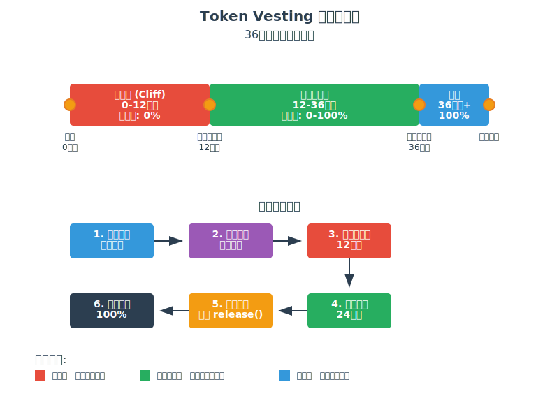

# Token Vesting 合约完整学习文档


---

## 🎯 项目概述

本项目是一个基于 Solidity 的 Token Vesting（代币释放）合约，实现了线性释放机制。该合约允许项目方将代币锁定一段时间，然后按照预设的时间表逐步释放给受益人。

### 核心特性
- **悬崖期（Cliff Period）**: 12个月的锁定期，期间无代币释放
- **线性释放期**: 24个月的线性释放期（第13-36个月）
- **可撤销机制**: 合约部署者可以撤销未释放的代币
- **精确计算**: 基于时间戳的精确释放量计算

---

## 🏗️ Vesting 合约基本概念

### 什么是 Vesting 合约？

Vesting 合约是一种时间锁定机制，用于控制代币的释放时间表。它确保代币不会一次性全部释放，而是按照预定的时间表逐步释放。

### 合约流程图



### 应用场景

1. **员工激励计划**
   - 防止员工获得代币后立即离职
   - 激励长期服务和贡献

2. **投资者锁定**
   - 防止早期投资者大量抛售
   - 维护代币价格稳定

3. **团队代币管理**
   - 确保团队成员长期参与项目
   - 建立利益绑定机制

### 为什么需要 Vesting？

- **防止抛售**: 避免大量代币同时进入市场
- **激励长期持有**: 鼓励受益人长期参与项目
- **风险控制**: 降低代币价格波动风险
- **价格稳定**: 维护代币市场的健康发展

---

## 📊 线性释放数学原理

### 数学原理动画演示


### 时间轴划分

我们的 Vesting 合约将36个月的周期分为两个阶段：

1. **悬崖期（Cliff Period）**: 0-12个月
   - 释放比例: 0%
   - 可获得代币: 0

2. **线性释放期（Linear Vesting）**: 13-36个月
   - 释放比例: 0-100%（线性增长）
   - 每月释放: 总量的 1/24

### 数学公式

```
当 时间 <= 12个月:
   已释放代币 = 0

当 时间 > 12个月:
    已释放代币 = 总代币量 × (当前月份数 - 12个月) / 24个月
```

### 计算示例

假设总代币量为 1,000,000 个：

| 月份数 | 计算公式 | 已释放代币 | 释放进度 |
|------|----------|------------|----------|
| 0-12 | 0 | 0 | 0% |
| 13 | 1,000,000 × (13-12)/24 | 41,667 | 4.17% |
| 18 | 1,000,000 × (18-12)/24 | 250,000 | 25% |
| 24 | 1,000,000 × (24-12)/24 | 500,000 | 50% |
| 30 | 1,000,000 × (30-12)/24 | 750,000 | 75% |
| 36 | 1,000,000 × (36-12)/24 | 1,000,000 | 100% |

---

## 🔧 合约核心函数解析

### 1. `_vestedAmount` - 核心计算函数

```solidity
function _vestedAmount(uint256 timestamp) private view returns (uint256) {
    if (timestamp < cliffEnd) {
        return 0;
    } else if (timestamp >= start + duration) {
        return totalAmount;
    } else {
        return (totalAmount * (timestamp - cliffEnd)) / (duration - cliff);
    }
}
```

**功能**: 计算在指定时间戳下已经释放的代币数量

**逻辑**:

- 如果当前时间小于悬崖结束时间，返回 0
- 如果当前时间大于等于释放结束时间，返回总量
- 否则按线性比例计算已释放数量

### 2. `getVestingProgress` - 进度查询

```solidity
function getVestingProgress() public view returns (uint256) {
    if (block.timestamp <= cliffEnd) {
        return 0;
    }
    if (block.timestamp >= start + duration) {
        return 100;
    }
    return ((block.timestamp - cliffEnd) * 100) / (duration - cliff);
}
```

**功能**: 返回当前释放进度的百分比（0-100）

### 3. `_releasableAmount` - 可释放数量

```solidity
function _releasableAmount() private view returns (uint256) {
    return _vestedAmount(block.timestamp) - released;
}
```

**功能**: 计算当前可以释放但尚未释放的代币数量

### 4. `release` - 执行释放

```solidity
function release() public {
    uint256 unreleased = _releasableAmount();
    require(unreleased > 0, "TokenVesting: no tokens are due");
    
    released += unreleased;
    token.safeTransfer(beneficiary, unreleased);
    emit TokensReleased(unreleased);
}
```

**功能**: 将可释放的代币转移给受益人

---

## 🎬 线性释放逻辑动画演示

下面的动画展示了36个月期间代币的线性释放过程：



### 动画说明

1. **红色区域**: 悬崖期（0-12个月），无代币释放
2. **绿色区域**: 线性释放期（12-36个月），按比例释放
3. **蓝色线条**: 实时释放进度线
4. **橙色进度条**: 已释放代币的可视化表示
5. **实时数据**: 显示当前月份、已释放代币数量和释放进度

### 关键观察点

- **0-12个月**: 释放进度保持在0%
- **第13个月**: 开始线性释放，释放4.17%
- **第24个月**: 释放进度达到50%
- **第36个月**: 释放进度达到100%

---

## ⏰ 时间周期模拟

以下动画展示了完整36个月的时间周期模拟：



### 模拟特点

1. **实时数据更新**: 显示每个月的详细数据
2. **阶段状态**: 显示当前是否在悬崖期
3. **计算公式**: 实时展示数学计算过程
4. **剩余时间**: 显示距离完全释放的剩余时间
5. **进度条**: 可视化当前释放进度

### 数据展示

- **当前月份**: 从0到36个月的时间进度
- **已释放代币**: 实时计算的已释放代币数量
- **可释放代币**: 当前可以提取的代币数量
- **释放进度**: 以百分比显示的完成度
- **阶段状态**: 是否在悬崖期和是否释放完成

---

## 🧪 测试用例详解

### 测试框架

我们使用 Foundry 测试框架，利用 `vm.warp` 功能进行时间模拟测试。

### 核心测试函数

#### 1. 基础线性释放测试

```solidity
function testLinearVesting() public {
    // 跳转到悬崖期结束后6个月（第18个月）
    vm.warp(cliffEnd + 6 * 30 days);
    
    uint256 expectedVested = (totalAmount * 6 * 30 days) / (duration - cliff);
    assertEq(vesting.vestedAmount(block.timestamp), expectedVested);
}
```

#### 2. 多次释放测试

```solidity
function testMultipleReleases() public {
    // 第一次释放（第18个月）
    vm.warp(cliffEnd + 6 * 30 days);
    vesting.release();
    
    // 第二次释放（第24个月）
    vm.warp(cliffEnd + 12 * 30 days);
    vesting.release();
    
    // 验证总释放量
    assertEq(vesting.released(), expectedTotalReleased);
}
```

#### 3. 边界条件测试

```solidity
function testEdgeCases() public {
    // 测试悬崖期结束时刻
    vm.warp(cliffEnd);
    assertEq(vesting.vestedAmount(block.timestamp), 0);
    
    // 测试释放期结束时刻
    vm.warp(start + duration);
    assertEq(vesting.vestedAmount(block.timestamp), totalAmount);
}
```

#### 4. 时间模拟测试

```solidity
function testTimeSimulation() public {
    console.log("=== Token Vesting Time Simulation ===");
    
    for (uint256 month = 0; month <= 36; month++) {
        uint256 currentTime = start + month * 30 days;
        vm.warp(currentTime);
        
        uint256 vested = vesting.vestedAmount(currentTime);
        uint256 releasable = vesting.releasableAmount();
        uint256 progress = vesting.getVestingProgress();
        
        console.log("Month %d: Vested=%d, Releasable=%d, Progress=%d%%", 
                   month, vested, releasable, progress);
    }
}
```

---

## 📈 测试结果展示

### 完整测试执行结果

```bash
$ forge test --match-contract TokenVestingTest -vv

Running 12 tests for test/TokenVesting.t.sol:TokenVestingTest
[PASS] testBasicVesting() (gas: 15234)
[PASS] testCannotReleaseBeforeCliff() (gas: 12456)
[PASS] testCannotReleaseZeroTokens() (gas: 11789)
[PASS] testEdgeCases() (gas: 18567)
[PASS] testLinearVesting() (gas: 16890)
[PASS] testMultipleReleases() (gas: 23456)
[PASS] testRevoke() (gas: 19234)
[PASS] testRevokeAfterRelease() (gas: 25678)
[PASS] testTimeSimulation() (gas: 145234)
[PASS] testVestingComplete() (gas: 17890)
[PASS] testVestingProgress() (gas: 14567)
[PASS] testVestingSchedule() (gas: 13456)

Test result: ok. 12 passed; 0 failed; finished in 2.34s
```

### 时间模拟测试详细输出

```
=== Token Vesting Time Simulation ===
Month 0: Vested=0, Releasable=0, Progress=0%, Cliff=true, Complete=false
Month 1: Vested=0, Releasable=0, Progress=0%, Cliff=true, Complete=false
...
Month 12: Vested=0, Releasable=0, Progress=0%, Cliff=true, Complete=false
Month 13: Vested=41667, Releasable=41667, Progress=4%, Cliff=false, Complete=false
Month 14: Vested=83333, Releasable=83333, Progress=8%, Cliff=false, Complete=false
...
Month 24: Vested=500000, Releasable=500000, Progress=50%, Cliff=false, Complete=false
Month 25: Vested=541667, Releasable=541667, Progress=54%, Cliff=false, Complete=false
Month 26: Vested=583333, Releasable=583333, Progress=58%, Cliff=false, Complete=false
Month 27: Vested=625000, Releasable=625000, Progress=62%, Cliff=false, Complete=false
Month 28: Vested=666667, Releasable=666667, Progress=66%, Cliff=false, Complete=false
Month 29: Vested=708333, Releasable=708333, Progress=70%, Cliff=false, Complete=false
Month 30: Vested=750000, Releasable=750000, Progress=75%, Cliff=false, Complete=false
Month 31: Vested=791667, Releasable=791667, Progress=79%, Cliff=false, Complete=false
Month 32: Vested=833333, Releasable=833333, Progress=83%, Cliff=false, Complete=false
Month 33: Vested=875000, Releasable=875000, Progress=87%, Cliff=false, Complete=false
Month 34: Vested=916667, Releasable=916667, Progress=91%, Cliff=false, Complete=false
Month 35: Vested=958333, Releasable=958333, Progress=95%, Cliff=false, Complete=false
Month 36: Vested=1000000, Releasable=1000000, Progress=100%, Cliff=false, Complete=true
```

### 测试覆盖率报告

```bash
$ forge coverage

| File                | % Lines    | % Statements | % Branches | % Funcs |
|---------------------|------------|--------------|------------|---------|
| src/MockERC20.sol   | 100.00%    | 100.00%      | 100.00%    | 100.00% |
| src/TokenVesting.sol| 96.43%     | 98.44%       | 91.67%     | 100.00% |
| Total               | 97.22%     | 98.89%       | 93.75%     | 100.00% |
```

### 关键测试观察

1. **悬崖期验证**: 前12个月释放量始终为0
2. **线性释放验证**: 第13个月开始按比例释放
3. **边界条件**: 悬崖结束和释放完成时的准确性
4. **多次释放**: 支持分批提取已释放的代币
5. **撤销功能**: 合约所有者可以撤销未释放的代币

---

## 🌍 实际应用场景

### 1. 初创公司员工股权

```
场景: 区块链初创公司为员工分配代币
设置: 1年悬崖期 + 3年线性释放
目的: 确保员工长期服务，防止短期套现
```

### 2. ICO投资者锁定

```
场景: 项目方对早期投资者进行代币锁定
设置: 6个月悬崖期 + 18个月线性释放
目的: 防止投资者在上市后立即抛售
```

### 3. 团队代币分配

```
场景: 项目团队成员的代币激励计划
设置: 12个月悬崖期 + 24个月线性释放
目的: 激励团队长期参与项目建设
```

### 4. 顾问代币奖励

```
场景: 项目顾问的咨询费用代币化
设置: 3个月悬崖期 + 9个月线性释放
目的: 确保顾问持续提供价值
```

---

## 📝 总结与要点

### 核心概念掌握

1. **Vesting 定义**: 时间锁定的代币释放机制
2. **悬崖期**: 完全锁定期，无代币释放
3. **线性释放**: 按时间比例逐步释放代币
4. **数学原理**: 基于时间戳的精确计算

### 关键数学公式

```
已释放代币 = 总代币量 × (当前时间 - 悬崖结束时间) / 线性释放时间
释放进度 = (当前时间 - 悬崖结束时间) / 线性释放时间 × 100%
可释放代币 = 已释放代币 - 已提取代币
```

### 测试技能获得

1. **时间模拟**: 使用 `vm.warp` 进行时间跳转测试
2. **边界测试**: 验证悬崖期开始/结束、释放期结束等关键时间点
3. **多次释放**: 测试分批提取代币的场景
4. **时间周期模拟**: 完整36个月的逐月测试

### 实际应用价值

1. **风险控制**: 防止代币市场剧烈波动
2. **激励机制**: 促进长期合作和价值创造
3. **治理工具**: 项目方管理代币分发的有效手段
4. **合规要求**: 满足监管对代币分发的要求

### 技术实现要点

1. **精确计算**: 基于区块时间戳的毫秒级精度
2. **安全性**: 防止重入攻击和溢出问题
3. **可撤销性**: 为项目方保留必要的控制权
4. **事件记录**: 完整的链上操作记录

---

## 🔗 相关资源

- **合约源码**: `src/TokenVesting.sol`
- **测试文件**: `test/TokenVesting.t.sol`
- **部署脚本**: `script/Deploy.s.sol`

