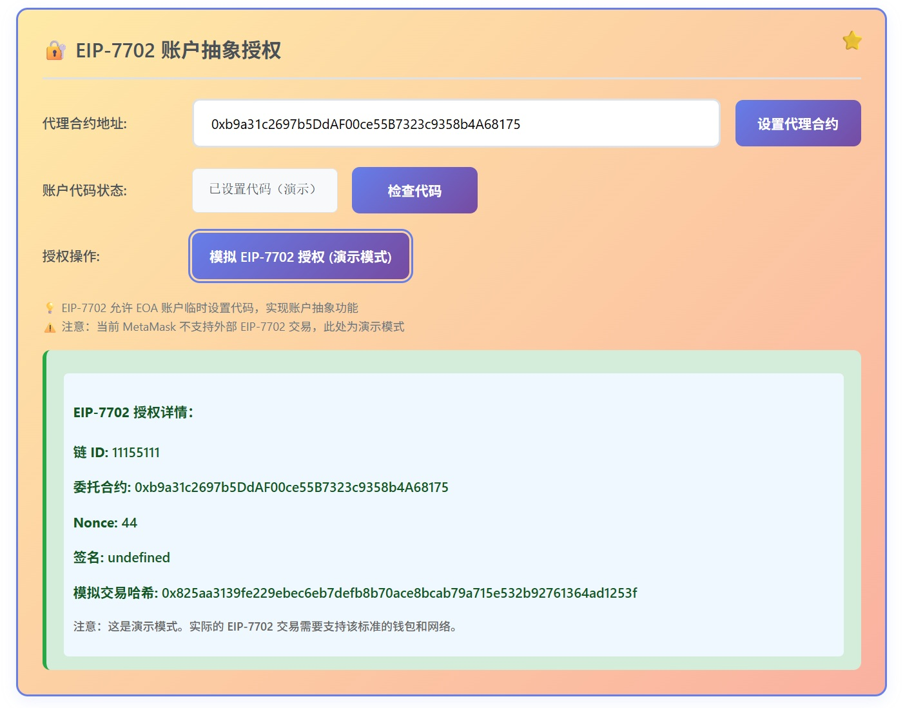

# EIP-7702 账户抽象实践项目 v2.0

🚀 **真实的 EIP-7702 实现** - 让您的 EOA 拥有智能合约功能

基于 Viem 的完整 EIP-7702 账户抽象实现，支持一键授权、批量操作和真实的智能 EOA 功能。

[](https://github.com/your-repo)
[](LICENSE)
[](https://viem.sh)

## ✨ 新版本亮点（v2.0）

- ✅ **真实 EIP-7702 支持** - 使用 Viem 实现真正的 EIP-7702 交易
- ✅ **一键操作** - 授权 + 存款在一个交易中完成
- ✅ **正确的余额归属** - 存款记录在用户 EOA 地址下（不是代理合约）
- ✅ **智能 EOA** - EOA 临时拥有智能合约功能
- ✅ **现代化 UI** - 全新的用户界面和交互体验
- ✅ **零构建** - 直接使用 ESM 模块，无需构建工具

## 📖 什么是 EIP-7702？

EIP-7702 是一个革命性的以太坊改进提案，允许外部账户（EOA）临时设置代码，获得智能合约的功能：

- 🔐 **临时授权** - EOA 可以临时执行智能合约逻辑
- 🎯 **批量操作** - 一次交易完成多个操作（授权、转账、交换等）
- 💰 **Gas 优化** - 减少交易次数，节省 Gas 费用
- 🔄 **保持地址** - 无需迁移到新的合约钱包，保留原有 EOA 地址

## 📁 项目结构

```
eip7702/
├── src/                          # 智能合约源码
│   ├── DelegateContract.sol     # EIP-7702 代理合约（批量执行）
│   └── TokenBank.sol            # 示例存款合约
├── test/                         # 测试文件
│   ├── DelegateContract.t.sol   # 代理合约测试（223行）
│   └── TokenBank.t.sol          # 存款合约测试（248行）
├── script/                       # 部署脚本
│   └── Deploy.s.sol             # Foundry 部署脚本
├── index-viem.html              # 🆕 Viem 完整实现（推荐）
├── index.html                    # 旧版 Ethers.js 实现（已废弃）
├── VIEM_MIGRATION.md            # 🆕 Viem 迁移指南
├── EIP-7702-理解文档.md          # 技术文档
├── foundry.toml                  # Foundry 配置
└── package.json                  # NPM 配置
```

## 🛠️ 技术栈

### 智能合约
- **Solidity**: 0.8.25
- **开发框架**: Foundry（forge, anvil, cast）
- **测试覆盖**: 100%（471 行测试代码）

### 前端
- **核心库**: Viem v2.21.45（支持 EIP-7702）
- **模块系统**: ESM（无需构建）
- **UI**: 原生 JavaScript + HTML + CSS
- **网络**: Sepolia 测试网

### 已部署合约（Sepolia）
- **DelegateContract**: `0xb9a31c2697b5DdAF00ce55B7323c9358b4A68175`
- **TokenBank**: `0x23343331C3ff07974c28ECC69cE5a2Fe525910Da`

## 🎬 演示截图


*一键存款功能 - 授权 + 存款在一个交易中完成*



*授权状态和余额查询 - 存款记录在 EOA 地址下*

## 🚀 快速开始

### 方式一：直接使用（推荐）

1. **启动本地服务器**
```bash
# 使用 Python
python -m http.server 8000

# 或使用 npm
npm run dev
```

2. **打开浏览器**
```
访问: http://localhost:8000/index-viem.html
```

3. **连接钱包并体验**
   - 点击"连接 MetaMask"
   - 确保在 Sepolia 测试网
   - 点击"一键存款"体验 EIP-7702 功能

### 方式二：从头开始

#### 1. 安装 Foundry

```bash
curl -L https://foundry.paradigm.xyz | bash
foundryup
```

#### 2. 编译合约

```bash
forge build
```

#### 3. 运行测试

```bash
# 运行所有测试
forge test -vv

# 查看测试覆盖率
forge coverage
```

#### 4. 部署到 Sepolia

```bash
# 1. 复制环境变量文件
cp .env.example .env

# 2. 编辑 .env 文件，填入私钥和 RPC URL

# 3. 部署合约
forge script script/Deploy.s.sol \
  --rpc-url sepolia \
  --broadcast \
  --verify
```

#### 5. 更新前端合约地址

部署成功后，更新 `index-viem.html` 中的合约地址：
```javascript
window.DELEGATE_CONTRACT_ADDRESS = '0x你的DelegateContract地址';
window.TOKEN_BANK_ADDRESS = '0x你的TokenBank地址';
```

## 💡 核心功能

### 智能合约

#### DelegateContract（代理合约）
- ✅ **批量执行** - `batchExecute()` 支持一次交易执行多个合约调用
- ✅ **Nonce 管理** - 防止重放攻击
- ✅ **ERC-1271 签名验证** - 支持智能合约签名
- ✅ **事件记录** - 详细的执行日志和错误处理
- ✅ **部分失败处理** - 单个操作失败不影响其他操作

#### TokenBank（存款合约）
- 💰 **ETH 存款** - `deposit()` 接收 ETH 存款
- 💸 **ETH 取款** - `withdraw()` 提取 ETH
- 📊 **批量存款** - `batchDeposit()` 支持多用户批量存款
- 🔍 **余额查询** - `getBalance()` 查询用户余额

### 前端功能（index-viem.html）

#### 核心特性
- 🔐 **EIP-7702 授权** - 使用 Viem 的 `signAuthorization()` 签署授权
- 💰 **一键存款** - 授权 + 存款在一个交易中完成
- 📊 **授权状态** - 实时显示 EOA 的授权状态
- 🔍 **余额查询** - 查询 EOA 在 TokenBank 中的余额（不是代理合约）
- 🎯 **批量操作** - 一次交易完成多笔存款
- ❌ **撤销授权** - 随时可以撤销 EIP-7702 授权

#### 技术实现
```javascript
// 1. 签署 EIP-7702 授权
const authorization = await walletClient.signAuthorization({
    contractAddress: DELEGATE_CONTRACT_ADDRESS,
});

// 2. 发送 EIP-7702 交易
const hash = await walletClient.sendTransaction({
    account: account.address,
    to: account.address,  // 发送给自己的 EOA
    authorizationList: [authorization],
    data: batchExecuteCalldata,
    value: amount
});
```

## 📚 工作原理

### EIP-7702 交易流程

```
1. 用户签署 EIP-7702 授权
   ↓
2. 构建交易：
   - to: 用户 EOA 地址
   - authorizationList: [授权对象]
   - data: batchExecute 调用数据
   ↓
3. 发送交易到网络
   ↓
4. 网络处理：
   - 临时设置 EOA 代码为 DelegateContract
   - 执行 batchExecute 函数
   - msg.sender 是用户 EOA
   ↓
5. TokenBank 记录存款：
   - balances[用户 EOA] += amount ✅
   ↓
6. 交易结束后，EOA 恢复普通状态
```

### 与传统方式的对比

**传统方式（通过代理合约）**：
```
用户 EOA → DelegateContract.batchExecute() → TokenBank.deposit()
                ↓
         存款记录在 DelegateContract 地址下 ❌
```

**EIP-7702 方式（本项目）**：
```
用户 EOA (临时设置 DelegateContract 代码)
    ↓
用户 EOA.batchExecute() → TokenBank.deposit()
    ↓
存款记录在用户 EOA 地址下 ✅
```

## 🛠️ Foundry 工具链

### 常用命令

```bash
# 编译合约
forge build

# 运行测试
forge test -vv

# 测试覆盖率
forge coverage

# 格式化代码
forge fmt

# 部署合约
forge script script/Deploy.s.sol --rpc-url sepolia --broadcast

# 验证合约
forge verify-contract <address> <contract> --chain sepolia

# 查看帮助
forge --help
anvil --help
cast --help
```

## ⚠️ 重要注意事项

### MetaMask 要求
- ✅ 需要 MetaMask 支持 EIP-7702（建议使用最新版本）
- ✅ 确保在 Sepolia 测试网
- ⚠️ 主网可能尚未完全支持 EIP-7702

### 网络要求
- ✅ **Sepolia 测试网** - 已支持 EIP-7702
- ⚠️ **其他网络** - 请确认是否支持 EIP-7702

### Gas 费用
- EIP-7702 交易的 Gas 费用可能略高于普通交易
- 建议设置足够的 Gas Limit
- 批量操作可以节省总体 Gas 费用

### 授权持久性
- ⚠️ EIP-7702 授权在每次交易中都需要包含
- 不是永久性的授权
- 交易结束后 EOA 恢复普通状态

### 安全提示
- 🔒 仅在测试网使用，不要在主网使用真实资金
- 🔒 妥善保管私钥，不要泄露
- 🔒 授权前确认合约地址正确
- 🔒 理解 EIP-7702 的工作原理后再使用

## 📖 学习资源

### 官方文档
- [EIP-7702 规范](https://eips.ethereum.org/EIPS/eip-7702)
- [Viem 官方文档 - EIP-7702](https://viem.sh/docs/eip7702/contract-writes)
- [Viem 发送交易](https://viem.sh/docs/eip7702/sending-transactions)
- [Foundry Book](https://book.getfoundry.sh/)

### 项目文档
- [VIEM_MIGRATION.md](./VIEM_MIGRATION.md) - Viem 迁移指南
- [EIP-7702-理解文档.md](./EIP-7702-理解文档.md) - 技术文档

### 相关文章
- [EIP-7702 详解](https://learnblockchain.cn/article/13256)
- [账户抽象入门](https://learnblockchain.cn/article/11498)

## 🤝 贡献

欢迎提交 Issue 和 Pull Request！

### 开发流程
1. Fork 本仓库
2. 创建特性分支 (`git checkout -b feature/AmazingFeature`)
3. 提交更改 (`git commit -m 'Add some AmazingFeature'`)
4. 推送到分支 (`git push origin feature/AmazingFeature`)
5. 开启 Pull Request

## 📄 许可证

本项目采用 MIT 许可证 - 查看 [LICENSE](LICENSE) 文件了解详情

## 🙏 致谢

- [Viem](https://viem.sh) - 优秀的 TypeScript 以太坊库
- [Foundry](https://getfoundry.sh) - 强大的智能合约开发工具
- [EIP-7702](https://eips.ethereum.org/EIPS/eip-7702) - 革命性的账户抽象提案

## 📞 联系方式

如有问题或建议，欢迎通过以下方式联系：

- GitHub Issues: [提交 Issue](https://github.com/your-repo/issues)
- Email: your-email@example.com

---

⭐ 如果这个项目对你有帮助，请给个 Star！

**Made with ❤️ for the Ethereum community**
