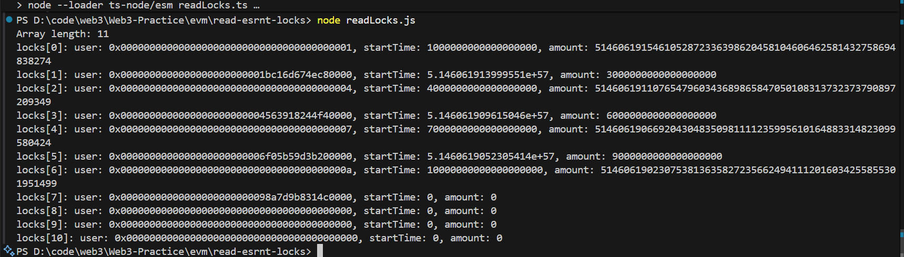

# EVM 存储读取工具 - Read ESRNT Locks

## 📖 项目简介

这是一个用于读取以太坊智能合约esRNT.sol存储数据的工具，该项目演示了如何直接从区块链存储槽中读取复杂的数据结构，包括动态数组和结构体。



## 🏗 项目结构

```
read-esrnt-locks/
├── .env                  # 环境变量配置文件
├── esRNT.sol             # esRNT合约文件
├── .gitignore           # Git 忽略文件
├── package.json          # 项目配置和依赖
├── package-lock.json     # 锁定依赖版本
├── readLocks.js          # 主要功能实现
└── README.md            # 项目文档
```

## 📦 安装依赖

```bash
# 安装项目依赖
npm install

# 或使用 yarn
yarn install
```

## ⚙️ 环境配置

### 1. 创建环境变量文件

复制 `.env` 文件并根据需要修改配置：

```bash
# 复制环境变量模板（如果没有就手动创建）
cp .env.local .env 
```

### 2. 配置环境变量

在 `.env` 文件中设置以下必要的环境变量：

```env
# 智能合约配置
CONTRACT_ADDRESS=0x(你的合约地址)

# RPC 端点配置
RPC_URL=https://sepolia.infura.io/v3/YOUR_INFURA_PROJECT_ID

# 网络配置
NETWORK=sepolia
```

**重要提示**：
- 请将 `YOUR_INFURA_PROJECT_ID` 替换为你的实际 Infura 项目 ID
- 如果使用其他 RPC 提供商，请相应修改 `RPC_URL`
- 确保 `.env` 文件已添加到 `.gitignore` 中，避免泄露敏感信息

### 3. 获取 Infura API Key

1. 访问 [Infura 官网](https://infura.io/)
2. 注册并创建新项目
3. 复制项目 ID 并替换 `.env` 文件中的 `YOUR_INFURA_PROJECT_ID`

## 🚀 使用方法

### 基本使用

```bash
# 运行脚本
node readLocks.js

# 或使用开发模式（如果有 TypeScript 版本）
npm run dev
```

### 配置说明

项目现在使用环境变量进行配置，所有敏感信息都存储在 `.env` 文件中：

```javascript
// 环境变量自动加载
dotenv.config();

// 从环境变量读取配置
const CONTRACT_ADDRESS = process.env.CONTRACT_ADDRESS;
const RPC_URL = process.env.RPC_URL;
```

**环境变量验证**：
- 程序启动时会自动验证必要的环境变量是否已设置
- 如果缺少必要配置，程序会抛出明确的错误信息

## 📊 数据结构

该工具读取的 Lock 结构体包含以下字段：

```solidity
struct Lock {
    address user;      // 用户地址 (20 bytes)
    uint64 startTime;  // 开始时间 (8 bytes)
    uint256 amount;    // 锁定金额 (32 bytes)
}
```

## 🔍 存储布局解析

### 动态数组存储规则

1. **数组长度**: 存储在声明的槽位（slot 0）
2. **数组数据**: 存储在 `keccak256(slot)` 开始的连续槽位
3. **元素间隔**: 每个 Lock 结构体占用 3 个存储槽

### 存储槽计算公式

```javascript
// 数组元素基础槽位
const baseSlot = BigInt(keccak256(pad(toBytes(arraySlot))));

// 特定元素的槽位
const elementSlot = baseSlot + BigInt(index) * elementSize;
```

## 📝 输出示例

```
Array length: 3
locks[0]: user: 0x742d35cc6634c0532925a3b8d0c9e3e4c413c123, startTime: 1697123456, amount: 1000000000000000000
locks[1]: user: 0x8ba1f109551bd432803012645hac136c0c8b456, startTime: 1697123500, amount: 2000000000000000000
locks[2]: user: 0x1234567890abcdef1234567890abcdef12345678, startTime: 1697123600, amount: 500000000000000000
```

## 🔧 开发说明

### 核心函数

- `getArrayElementSlot()`: 计算动态数组元素的存储槽位置
- `readLocks()`: 主要读取函数，遍历并解析所有锁定数据
- `client.getStorageAt()`: Viem 提供的存储读取方法

### 数据类型处理

- **Address**: 从 32 字节中提取右对齐的 20 字节
- **Uint64**: 使用 `hexToNumber()` 转换
- **Uint256**: 使用 `hexToBigInt()` 处理大数

## 🌐 网络配置

当前配置使用 Sepolia 测试网，可以修改为其他网络：

```javascript
// 主网
import { mainnet } from 'viem/chains';

// 其他测试网
import { goerli, polygon } from 'viem/chains';
```

## ⚠️ 注意事项

1. **环境变量安全**: 
   - 确保 `.env` 文件已添加到 `.gitignore` 中
   - 不要将包含真实 API 密钥的 `.env` 文件提交到版本控制系统
   - 在生产环境中使用环境变量或密钥管理服务

2. **RPC 限制**: 注意 RPC 提供商的请求频率限制

3. **合约地址**: 确保合约地址正确且已部署

4. **网络选择**: 确保选择正确的网络链

5. **数据格式**: 不同的数据类型需要不同的解析方法

6. **API 密钥管理**: 
   - 定期轮换 API 密钥
   - 监控 API 使用情况
   - 设置适当的访问限制

## 📄 许可证

本项目采用 ISC 许可证 - 查看 [LICENSE](LICENSE) 文件了解详情

- 

---

**注意**: 这是一个教育和演示项目，用于学习以太坊存储机制。在生产环境中使用时请谨慎处理私钥和敏感数据。