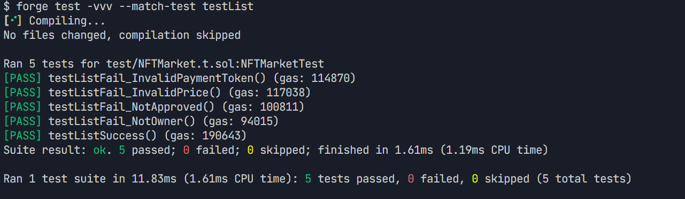
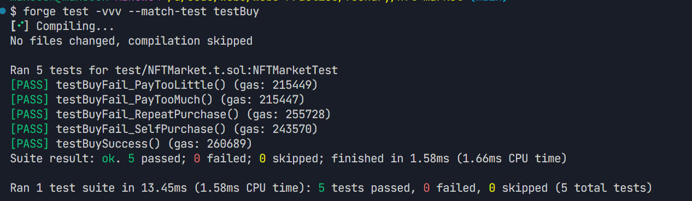
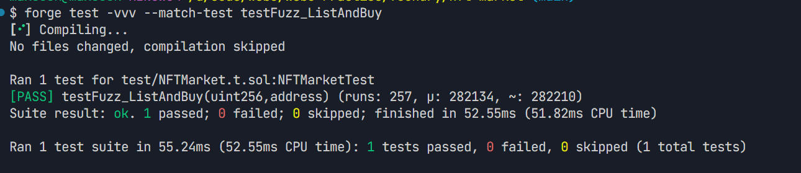
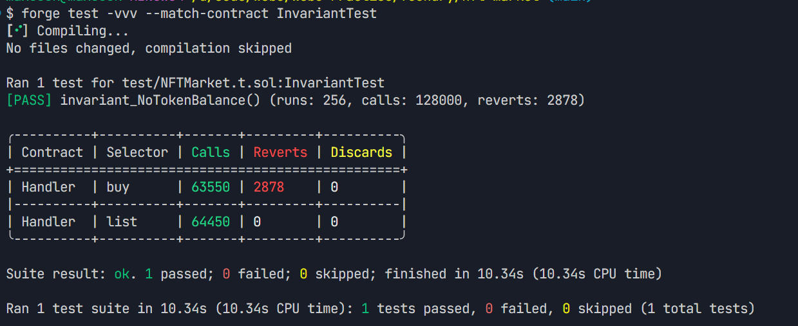

# NFTMarket — 基于 ERC20 计价的 NFT 市场

实现了一个简洁的 NFT 市场合约，支持使用任意 ERC20 Token 设定价格上架 ERC721 NFT，并使用对应 ERC20 支付购买。项目使用 Foundry 进行开发与测试，包含单元测试、模糊测试以及「不可变」测试，确保市场合约中不持有任何 Token 余额。

## 功能特性
- 使用任意 ERC20 价格上架 ERC721 NFT（托管模式）。
- 使用指定 ERC20 Token 支付购买 NFT。
- 事件与错误信息完备，便于前端与测试集成。
- 模糊测试覆盖随机价格与随机买家地址。
- 不可变测试保证市场合约不会持有任何 Token。

## 目录结构

```
foundry/nft-market
├── foundry.toml             # Foundry 配置与库映射
├── README.md                
├── .gitignore               
├── forge-test-result.txt    # forge test 输出结果
├── src                      # 合约源码
│   ├── NFTMarket.sol        # 市场合约：上架与购买逻辑
│   ├── TestERC20.sol        # 测试 ERC20：铸造、授权、转账
│   └── TestERC721.sol       # 测试 ERC721：铸造、授权
├── test                     # 测试用例
│   └── NFTMarket.t.sol      # 单元、模糊、不可变测试
└── images                   # README 插图
    ├── 2.jpg                # 上架测试示意
    ├── 3.jpg                # 购买测试示意
    ├── 4.jpg                # 模糊测试示意
    └── 5.jpg                # 不可变测试示意
```

## 合约 API
- 上架函数 `list`（`src/NFTMarket.sol:27`）
  - 参数：`nft`（ERC721 地址）、`tokenId`、`paymentToken`（ERC20 地址）、`price`。
  - 逻辑：校验价格与支付 Token、所有权与授权；将 NFT 托管到市场并记录上架信息；触发 `Listed` 事件（`src/NFTMarket.sol:24`）。
- 购买函数 `buy`（`src/NFTMarket.sol:44`）
  - 参数：`nft`、`tokenId`、`amount`（支付金额）。
  - 逻辑：校验上架存在、禁止自买、金额必须等于标价；将 ERC20 从买家转至卖家；安全转移 NFT 至买家；删除上架；触发 `Purchased` 事件（`src/NFTMarket.sol:25`）。

### 事件
- `Listed(address nft, uint256 tokenId, address seller, address paymentToken, uint256 price)`（`src/NFTMarket.sol:24`）
- `Purchased(address nft, uint256 tokenId, address seller, address buyer, address paymentToken, uint256 price)`（`src/NFTMarket.sol:25`）

### 错误类型
- `NotOwner`（`src/NFTMarket.sol:16`）：非持有人尝试上架。
- `NotApproved`（`src/NFTMarket.sol:17`）：未授权市场合约转移 NFT。
- `InvalidPrice`（`src/NFTMarket.sol:18`）：价格为 0。
- `InvalidPaymentToken`（`src/NFTMarket.sol:19`）：支付 Token 地址为 0。
- `NoListing`（`src/NFTMarket.sol:20`）：购买时无上架信息。
- `SelfPurchase`（`src/NFTMarket.sol:21`）：卖家自买自卖。
- `AmountMismatch`（`src/NFTMarket.sol:22`）：支付金额不等于标价。

## 环境准备
- 安装 Foundry（推荐）
  - Linux/macOS：`curl -L https://foundry.paradigm.xyz | bash && foundryup`
  - Windows（Git Bash）：使用上方命令或参考 Foundry 官方文档安装。
- 本项目使用仓库内已存在的库映射（`foundry.toml`）：
  - `forge-std` 映射到仓库已有路径：`../../contractAudit/lib/forge-std/src/`
  - `@openzeppelin` 映射到仓库已有路径：`../../defi/vesting/lib/openzeppelin-contracts/`
  - 如你的仓库结构不同，请在 `foundry/nft-market/foundry.toml` 中调整 `libs` 与 `remappings`。

## 编译与测试
- 进入项目目录：
  - `cd Web3-Practice\foundry\nft-market`
- 运行测试（详细日志）：
  - `forge test -vvv`
- 生成测试输出 TXT 文件：
  - Git Bash：`forge test -vvv | tee forge-test-result.txt`
  - PowerShell：`forge test -vvv | Tee-Object -FilePath forge-test-result.txt`
- 测试输出保存于：`foundry/nft-market/forge-test-result.txt`

## 按用例执行与结果查询

### 上架测试
- 运行全部上架相关用例：
  - `forge test -vvv --match-test testList`
  
    
  
- 运行单个用例：
  - 成功上架：`forge test -vvv --match-test testListSuccess`
  - 失败场景：
    - 非持有人上架：`forge test -vvv --match-test testListFail_NotOwner`
    - 未授权上架：`forge test -vvv --match-test testListFail_NotApproved`
    - 价格为零：`forge test -vvv --match-test testListFail_InvalidPrice`
    - 支付 Token 为零：`forge test -vvv --match-test testListFail_InvalidPaymentToken`
  
- 如何查看上架成功或失败：
  - 成功：输出中出现 `PASS`，并在详细 trace 中可见 `emit Listed(...)` 与 NFT 被托管到市场地址的转移记录。
  - 失败：输出中出现 `PASS`（表示预期的失败断言已成立），并在 trace 中可见相应 `Revert` 以及错误选择器匹配（如 `NotOwner`、`NotApproved` 等）。建议使用 `-vvvv` 以获得更详细回溯。

### 购买测试
- 运行全部购买相关用例：
  - `forge test -vvv --match-test testBuy`
  
  
- 运行单个用例：
  - 成功购买：`forge test -vvv --match-test testBuySuccess`
  - 失败场景：
    - 自买自卖：`forge test -vvv --match-test testBuyFail_SelfPurchase`
    - 重复购买：`forge test -vvv --match-test testBuyFail_RepeatPurchase`
    - 支付过少：`forge test -vvv --match-test testBuyFail_PayTooLittle`
    - 支付过多：`forge test -vvv --match-test testBuyFail_PayTooMuch`
- 如何查看购买成功或失败：
  - 成功：输出中出现 `PASS`，trace 中可见 `emit Purchased(...)`，以及 ERC20 从买家转至卖家、NFT 从市场转至买家的转移记录。
  - 失败：输出中出现 `PASS`（预期的失败断言），trace 中可见 `Revert` 以及错误选择器匹配（如 `SelfPurchase`、`NoListing`、`AmountMismatch`）。

### 模糊测试
- 运行模糊测试：
  - `forge test -vvv --match-test testFuzz_ListAndBuy`
  
    
  
- 查看结果：
  - 输出中包含 `runs`、`μ`、`~` 等统计信息，出现 `PASS` 即表示所有随机用例均满足断言。
  - 该测试会随机在 `0.01` 至 `10000` Token 范围设价并使用随机地址购买，断言购买完成后市场合约的 Token 余额为 `0`。

### 「不可变」测试
- 只运行不可变测试套件：
  - `forge test -vvv --match-contract InvariantTest`
  
  
- 或运行具体不可变测试：
  - `forge test -vvv --match-test invariant_NoTokenBalance`
- 查看结果：
  - 输出中包含多次 `runs/calls/reverts` 统计，出现 `PASS` 表示在大量随机序列的上架与购买操作下，市场合约的 Token 余额始终为 `0`。

### 进阶：JSON 输出与过滤
- 机器可读输出：
  - `forge test --json` 可输出 JSON 结果，便于脚本化处理与 CI 集成。
- 过滤测试：
  - 仅运行某个测试合约：`forge test -vvv --match-contract NFTMarketTest`
  - 仅运行某个文件：`forge test -vvv --match-path test/NFTMarket.t.sol`

## 测试覆盖说明
- 上架测试
  - 成功上架：断言 `Listed` 事件、托管与上架记录正确。
  - 失败用例：非持有人、未授权、价格为零、支付 Token 为零，对应错误断言。
- 购买测试
  - 成功购买：断言 `Purchased` 事件、NFT 归属、卖家收款、市场合约 Token 余额为 0。
  - 失败用例：自买自卖、重复购买、支付过少、支付过多，对应错误断言。
- 模糊测试
  - 随机价格范围：`0.01` 至 `10000` Token（`18` 位精度），随机买家地址（限制为 EOA）。
- 「不可变」测试
  - 保证市场合约在任意买卖序列下 ERC20 余额始终为 `0`（`test/NFTMarket.t.sol` 中的 `InvariantTest`）。

## 具体操作说明（上架与购买流程）
- 上架前置条件：
  - 卖家持有 `tokenId` 对应的 NFT。
  - 卖家已对市场合约 `approve` 或 `setApprovalForAll`。
- 上架：
  - 调用 `list(nft, tokenId, paymentToken, price)`（`src/NFTMarket.sol:27`）。
  - 成功后，NFT 会被托管至市场合约地址，并触发 `Listed` 事件。
- 购买前置条件：
  - 买家持有足额的 `paymentToken` 并 `approve` 市场合约。
- 购买：
  - 调用 `buy(nft, tokenId, amount)`（`src/NFTMarket.sol:44`），`amount` 必须等于上架价格。
  - 成功后，ERC20 从买家转至卖家，NFT 从市场合约转至买家，并触发 `Purchased` 事件。

## 设计要点与安全性
- 托管模式避免交易期间的授权风险，购买时使用 `safeTransferFrom` 保证接收方兼容性。
- 市场合约仅在购买时中转 NFT，不持有 ERC20 Token 余额，便于审计与安全保证。
- 错误与事件完备，有利于前端状态展示与测试断言。


