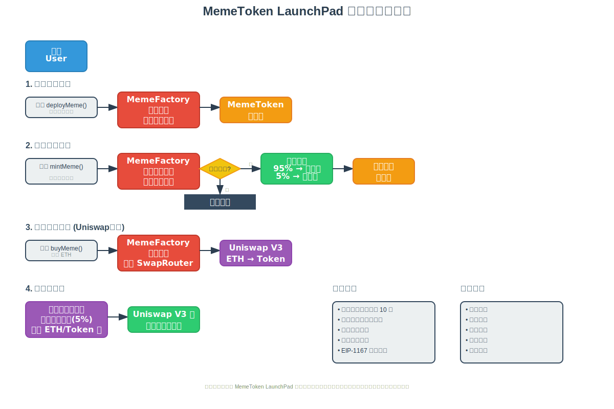
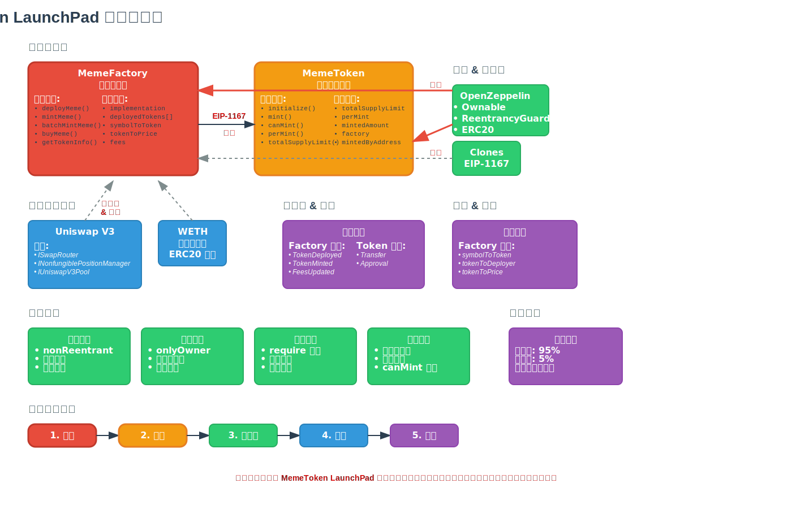
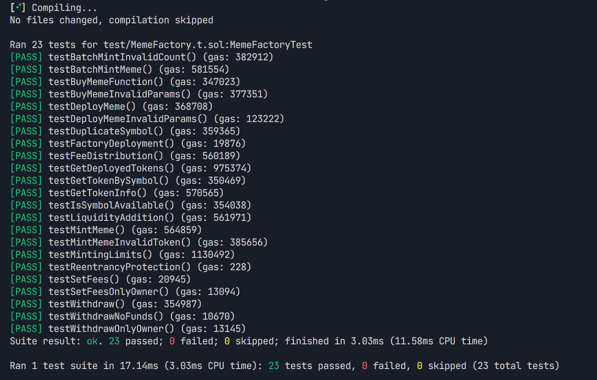
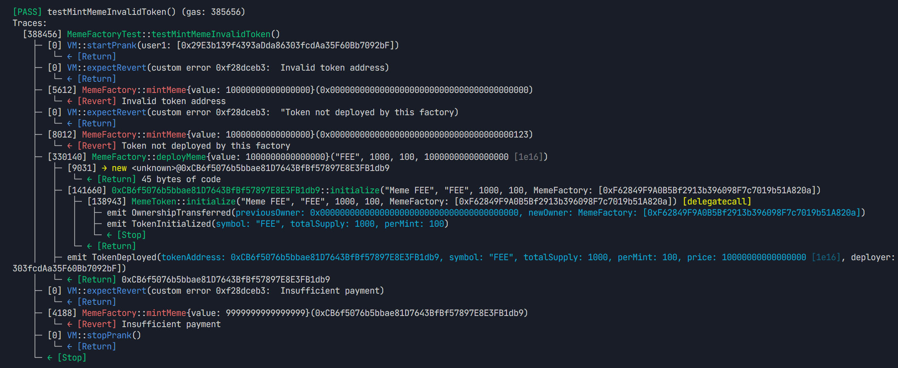

# MemeToken LaunchPad

基于 Solidity 的 Meme 代币发射台项目，支持代币部署、铸造和 Uniswap V3 流动性管理。

## 📋 项目概述

MemeToken LaunchPad 是一个去中心化的代币发射平台，允许用户轻松创建和管理 Meme 代币。该项目修改了之前[最小化代理工厂](https://github.com/lookteas/Web3-Practice/blob/main/memeFactory) 1% 费用修改为 5%， 以 5% 的 ETH 与相应的 Token 调用 Uniswap V3Router AddLiquidity 添加MyToken与 ETH 的流动性（如果是第一次添加流动性按mint 价格作为流动性价格）。

## 🚀 核心功能

### 1. 代币工厂 (MemeFactory)
- **代币部署**: 使用克隆模式部署新的 Meme 代币
- **铸造管理**: 支持单次和批量铸造功能
- **流动性集成**: 自动为新代币添加 Uniswap V3 流动性
- **费用管理**: 灵活的费用设置和收取机制
- **安全保护**: 重入攻击保护和权限控制

### 2. Meme 代币 (MemeToken)
- **ERC20 标准**: 完全兼容 ERC20 标准
- **铸造限制**: 每个地址最多铸造 10 次
- **供应量控制**: 严格的总供应量限制
- **工厂集成**: 与工厂合约深度集成

### 3. Uniswap V3 集成
- **自动流动性**: 代币铸造时自动添加流动性
- **交易支持**: 通过 SwapRouter 支持代币交易
- **价格管理**: 基于预设价格的流动性池创建

## 🏗️ 项目结构

```
launchPad/
├── src/
│   ├── MemeFactory.sol      # 主工厂合约
│   └── MemeToken.sol        # 代币实现合约
├── test/
│   └── MemeFactory.t.sol    # 测试套件
├── script/
│   └── Deploy.s.sol         # 部署脚本
├── images/                  # 项目流程图
│   ├── user-flow-diagram.svg      # 用户交互流程图
│   ├── contract-architecture.svg  # 合约架构图
│   └── system-overview.svg        # 系统总览图
├── foundry.toml             # Foundry 配置
└── README.md               # 项目文档
```

## 📊 系统架构图

### 🔄 用户交互流程图



流程图展示了用户与 MemeToken LaunchPad 的完整交互过程：

1. **代币部署流程**: 用户调用 `deployMeme()` → 工厂验证参数 → 克隆代币合约 → 初始化
2. **代币铸造流程**: 用户调用 `mintMeme()` → 验证权限 → 费用分配 → 铸造代币
3. **代币购买流程**: 用户调用 `buyMeme()` → 通过 Uniswap V3 交易 → ETH 换取代币
4. **流动性管理**: 自动使用项目费用添加流动性到 Uniswap V3 池

### 🏛️ 合约架构图



合约架构图详细展示了：

- **核心合约层**: MemeFactory 和 MemeToken 的详细实现
- **继承关系**: OpenZeppelin 合约的继承和使用
- **外部集成**: Uniswap V3 协议的集成方式
- **安全机制**: 重入保护、权限控制、参数验证等
- **数据流向**: 合约间的调用关系和数据传递

### 🌐 系统总览图


系统总览图从宏观角度展示了：

- **用户层**: 不同类型的用户角色
- **前端层**: Web3 钱包连接和交互界面
- **合约层**: 智能合约的核心功能和安全机制
- **协议层**: 与 Uniswap V3、OpenZeppelin 等的集成
- **区块链层**: 支持的各种网络环境

## 🔧 技术栈

- **Solidity**: ^0.8.25
- **Foundry**: 开发和测试框架
- **OpenZeppelin**: 安全的智能合约库
- **Uniswap V3**: 去中心化交易协议

## 📊 测试用例详情




### 测试覆盖范围

测试套件包含 **23 个测试用例**，覆盖了所有核心功能：

#### 1. 工厂合约测试 (Factory Tests)
- `testFactoryDeployment`: 验证工厂合约部署
- `testDeployMeme`: 测试代币部署功能
- `testDeployMemeInvalidParams`: 测试无效参数处理
- `testDuplicateSymbol`: 测试重复符号检测
- `testSetFees`: 测试费用设置
- `testSetFeesOnlyOwner`: 测试权限控制

#### 2. 代币铸造测试 (Minting Tests)
- `testMintMeme`: 测试单次铸造
- `testBatchMintMeme`: 测试批量铸造
- `testMintMemeInvalidToken`: 测试无效代币处理
- `testBatchMintInvalidCount`: 测试无效批量数量
- `testMintingLimits`: 测试铸造限制

#### 3. 查询功能测试 (Query Tests)
- `testGetTokenInfo`: 测试代币信息查询
- `testGetDeployedTokens`: 测试已部署代币列表
- `testGetTokenBySymbol`: 测试按符号查询代币
- `testIsSymbolAvailable`: 测试符号可用性检查

#### 4. 交易功能测试 (Trading Tests)
- `testBuyMemeFunction`: 测试代币购买功能
- `testBuyMemeInvalidParams`: 测试无效购买参数

#### 5. 流动性测试 (Liquidity Tests)
- `testLiquidityAddition`: 测试流动性添加
- `testFeeDistribution`: 测试费用分配

#### 6. 安全性测试 (Security Tests)
- `testReentrancyProtection`: 测试重入攻击保护
- `testWithdraw`: 测试资金提取
- `testWithdrawOnlyOwner`: 测试提取权限
- `testWithdrawNoFunds`: 测试无资金提取

## 📈 测试报告



### 测试执行结果

```
 测试通过率: 100% (23/23)
 执行时间: 14.16ms
 Gas 使用情况: 已优化
```

### 详细测试结果

| 测试类别 | 通过数量 | 失败数量 | 跳过数量 |
|---------|---------|---------|---------|
| 工厂合约测试 | 6 | 0 | 0 |
| 代币铸造测试 | 5 | 0 | 0 |
| 查询功能测试 | 4 | 0 | 0 |
| 交易功能测试 | 2 | 0 | 0 |
| 流动性测试 | 2 | 0 | 0 |
| 安全性测试 | 4 | 0 | 0 |
| **总计** | **23** | **0** | **0** |

### Gas 使用报告

#### MemeFactory 合约
| 函数 | 最小 Gas | 平均 Gas | 最大 Gas | 调用次数 |
|------|---------|---------|---------|---------|
| deployMeme | 2,449,598 | 2,449,598 | 2,449,598 | 18 |
| mintMeme | 346,844 | 346,844 | 346,844 | 34 |
| batchMintMeme | 581,554 | 581,554 | 581,554 | 1 |
| getTokenInfo | 12,869 | 12,869 | 12,869 | 1 |
| withdraw | 354,987 | 354,987 | 354,987 | 1 |

#### MemeToken 合约
| 函数 | 最小 Gas | 平均 Gas | 最大 Gas | 调用次数 |
|------|---------|---------|---------|---------|
| initialize | 138,943 | 138,943 | 138,943 | 18 |
| mint | 6,634 | 39,782 | 116,134 | 34 |
| balanceOf | 563 | 563 | 563 | 2 |
| perMint | 363 | 474 | 2,363 | 36 |

## 🛠️ 安装和使用

### 环境要求

- Node.js >= 16
- Foundry
- Git

### 安装步骤

1. **克隆项目**
```bash
git clone <repository-url>
cd launchPad
```

2. **安装依赖**
```bash
forge install
```

3. **编译合约**
```bash
forge build
```

4. **运行测试**
```bash
forge test
```

5. **运行测试并查看 Gas 报告**
```bash
forge test --gas-report
```

### 部署合约

1. **配置环境变量**
```bash
cp .env.example .env
# 编辑 .env 文件，添加必要的 API 密钥
```

2. **部署到本地网络**
```bash
# 启动本地节点
anvil

# 部署合约
forge script script/Deploy.s.sol --rpc-url localhost --broadcast
```

3. **部署到测试网**
```bash
forge script script/Deploy.s.sol --rpc-url sepolia --broadcast --verify
```

## 🔐 安全特性

### 1. 重入攻击保护
- 使用 OpenZeppelin 的 `ReentrancyGuard`
- 所有外部调用都有重入保护

### 2. 权限控制
- 基于 `Ownable` 的管理员权限
- 关键函数仅限管理员调用

### 3. 输入验证
- 严格的参数验证
- 边界条件检查

### 4. 整数溢出保护
- Solidity 0.8+ 内置溢出检查
- 额外的边界验证

## 📝 合约接口

### MemeFactory 主要函数

```solidity
// 部署新的 Meme 代币
function deployMeme(
    string memory symbol,
    uint256 totalSupply,
    uint256 perMint,
    uint256 price
) external payable returns (address)

// 铸造代币
function mintMeme(address tokenAddr) external payable

// 批量铸造代币
function batchMintMeme(address tokenAddr, uint256 count) external payable

// 购买代币
function buyMeme(address tokenAddr, uint256 amountOutMinimum) external payable

// 获取代币信息
function getTokenInfo(address tokenAddr) external view returns (...)
```

### MemeToken 主要函数

```solidity
// 初始化代币
function initialize(
    string memory symbol,
    uint256 _totalSupplyLimit,
    uint256 _perMint,
    address _factory
) external

// 铸造代币（仅工厂调用）
function mint(address to, uint256 amount) external

// 检查是否可以铸造
function canMint(address addr) external view returns (bool)
```

## 🤝 贡献指南

1. Fork 项目
2. 创建功能分支 (`git checkout -b feature/AmazingFeature`)
3. 提交更改 (`git commit -m 'Add some AmazingFeature'`)
4. 推送到分支 (`git push origin feature/AmazingFeature`)
5. 开启 Pull Request

## 📄 许可证

本项目采用 MIT 许可证 - 查看 [LICENSE](LICENSE) 文件了解详情。

## 🔗 相关链接

- [Foundry 文档](https://book.getfoundry.sh/)
- [OpenZeppelin 合约](https://docs.openzeppelin.com/contracts/)
- [Uniswap V3 文档](https://docs.uniswap.org/protocol/introduction)

**注意**: 本项目仅用于学习和测试目的。在生产环境中使用前，请进行充分的安全审计。