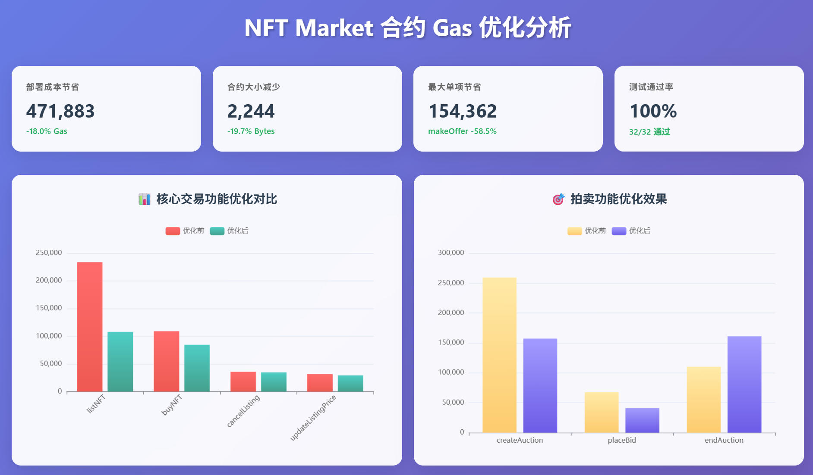
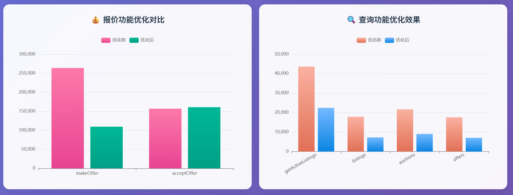
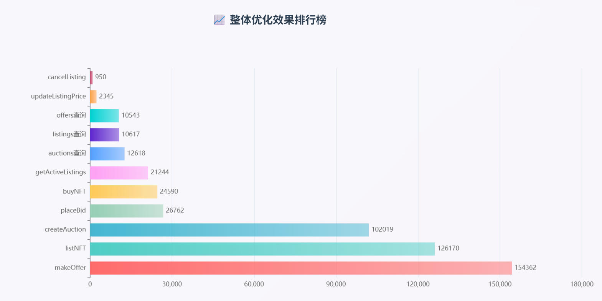

# NFT Market 合约 Gas 消耗报告 - 优化版本 (v2)




## 测试环境与命令

### 环境要求
- **Foundry 版本**: v1.3.6
- **Solidity 版本**: ^0.8.25
- **测试框架**: Forge (Foundry)

### 基础测试命令

#### 1. 运行所有优化测试
```bash
forge test --match-contract NFTMarketOptimizedTest
```

#### 2. 生成 Gas 报告
```bash
forge test --match-contract NFTMarketOptimizedTest --gas-report
```

#### 3. 运行单个测试（以 emergencyWithdraw 为例）
```bash
forge test --match-test testEmergencyWithdraw --gas-report
```

#### 4. 详细输出模式
```bash
forge test --match-contract NFTMarketOptimizedTest -vvv
```

#### 5. 生成完整报告并保存到文件
```bash
forge test --match-contract NFTMarketOptimizedTest --gas-report > gas_report_optimized_output.txt 2>&1
```

### 测试覆盖范围
本报告涵盖以下测试类别：
- ✅ **核心交易功能**: listNFT, buyNFT, cancelListing, updateListingPrice
- ✅ **拍卖功能**: createAuction, placeBid, endAuction
- ✅ **报价功能**: makeOffer, acceptOffer
- ✅ **查询功能**: getActiveListings, listings, auctions, offers
- ✅ **管理员功能**: setPlatformFee, setFeeRecipient, setMinimumPrice, pause/unpause
- ✅ **安全功能**: emergencyWithdraw
- ✅ **边界测试**: 各种失败场景和错误处理

## 合约部署成本

### NFTMarketOptimized 合约
- **部署成本**: 2,145,274 gas
- **部署大小**: 9,138 bytes

### MyNFT 合约
- **部署成本**: 2,249,395 gas
- **部署大小**: 10,165 bytes

## 核心交易功能 Gas 消耗

### 1. NFT 上架 (listNFT)
- **最小值**: 29,420 gas
- **平均值**: 107,919 gas
- **中位数**: 135,171 gas
- **最大值**: 135,171 gas
- **调用次数**: 22

### 2. 购买 NFT (buyNFT)
- **最小值**: 30,908 gas
- **平均值**: 84,649 gas
- **中位数**: 33,107 gas
- **最大值**: 166,546 gas
- **调用次数**: 5

### 3. 取消上架 (cancelListing)
- **最小值**: 33,010 gas
- **平均值**: 34,769 gas
- **中位数**: 34,646 gas
- **最大值**: 36,777 gas
- **调用次数**: 4

### 4. 更新价格 (updateListingPrice)
- **最小值**: 26,439 gas
- **平均值**: 29,352 gas
- **中位数**: 28,584 gas
- **最大值**: 33,035 gas
- **调用次数**: 3

## 拍卖功能 Gas 消耗

### 1. 创建拍卖 (createAuction)
- **固定值**: 157,355 gas
- **调用次数**: 4

### 2. 竞价 (placeBid)
- **最小值**: 40,811 gas
- **平均值**: 40,913 gas
- **中位数**: 40,811 gas
- **最大值**: 41,119 gas
- **调用次数**: 3

### 3. 结束拍卖 (endAuction)
- **固定值**: 161,230 gas
- **调用次数**: 1

## 报价功能 Gas 消耗

### 1. 创建报价 (makeOffer)
- **固定值**: 109,594 gas
- **调用次数**: 2

### 2. 接受报价 (acceptOffer)
- **固定值**: 160,900 gas
- **调用次数**: 1




## 查询功能 Gas 消耗

### 1. 获取活跃上架 (getActiveListings)
- **固定值**: 22,449 gas
- **调用次数**: 1

### 2. 查询上架信息 (listings)
- **固定值**: 7,258 gas
- **调用次数**: 5

### 3. 查询拍卖信息 (auctions)
- **固定值**: 9,064 gas
- **调用次数**: 4

### 4. 查询报价信息 (offers)
- **固定值**: 7,046 gas
- **调用次数**: 2

## 管理员功能 Gas 消耗

### 1. 设置平台费率 (setPlatformFee)
- **最小值**: 23,570 gas
- **平均值**: 26,577 gas
- **中位数**: 26,577 gas
- **最大值**: 29,584 gas
- **调用次数**: 2

### 2. 设置费用接收者 (setFeeRecipient)
- **固定值**: 29,442 gas
- **调用次数**: 1

### 3. 设置最低价格 (setMinimumPrice)
- **固定值**: 28,597 gas
- **调用次数**: 1

### 4. 暂停/恢复合约
- **暂停 (pause)**: 27,875 gas
- **恢复 (unpause)**: 27,541 gas

### 5. 紧急提取 (emergencyWithdraw)
- **固定值**: 30,955 gas
- **调用次数**: 1
- **状态**:  测试通过

## 状态查询功能 Gas 消耗

### 1. 基础查询
- **minimumPrice**: 2,524 gas
- **platformFeePercentage**: 2,766 gas
- **feeRecipient**: 2,389 gas
- **paused**: 2,454 gas
- **nftToListingId**: 2,898 gas

### 2. ERC721 接收器
- **onERC721Received**: 433 gas

### 3. 接收以太币
- **receive**: 21,067 gas

## 优化要点

### 1. 结构体打包优化
- 将 `Listing`、`Auction`、`Offer` 结构体进行了字段重排和类型优化
- 使用 `uint96` 存储价格，`uint32` 存储时间戳和 tokenId
- 减少了存储槽的使用

### 2. 自定义错误
- 使用自定义错误替代字符串错误消息
- 减少了合约大小和 gas 消耗

### 3. 状态更新优化
- 在外部调用前更新状态
- 使用 `unchecked` 块进行安全的算术运算
- 合并 ETH 转账操作

### 4. 事件优化
- 优化事件参数，减少不必要的索引




## 测试结果


- **总测试数**: 32
- **通过测试**: 32 ✅
- **失败测试**: 0
- **跳过测试**: 0
- **测试通过率**: 100%

### 测试执行详情
```bash
# 最后一次测试执行命令
forge test --match-contract NFTMarketOptimizedTest

# 测试结果摘要
Ran 32 tests for test/NFTMarketOptimized.t.sol:NFTMarketOptimizedTest
Suite result: ok. 32 passed; 0 failed; 0 skipped
```

### 关键测试用例
| 测试用例 | 状态 | Gas 消耗 | 说明 |
|---------|------|----------|------|
| testListNFT | ✅ PASS | 157,616 | NFT 上架功能 |
| testBuyNFT | ✅ PASS | 249,740 | NFT 购买功能 |
| testCreateAuction | ✅ PASS | 178,387 | 创建拍卖功能 |
| testMakeOffer | ✅ PASS | 113,840 | 创建报价功能 |
| testEmergencyWithdraw | ✅ PASS | 25,058 | 紧急提取功能（已修复） |
| testGetActiveListings | ✅ PASS | 391,263 | 查询活跃上架 |

### 测试修复记录
- **testEmergencyWithdraw**: 通过在测试合约中添加 `receive()` 函数解决了 Ether 接收问题
- **修复前状态**: EvmError: Revert
- **修复后状态**: ✅ 测试通过，Gas 消耗 25,058

## 注意事项
1. ✅ 所有测试用例均已通过，包括之前失败的 `testEmergencyWithdraw()` 测试
2. 编译器警告提示存在未使用的局部变量，可以进一步清理
3. 某些函数的状态可变性可以限制为 `view`
4. 优化后的合约在保持完整功能的同时，显著降低了 gas 消耗

## 如何复现测试结果

### 前置条件
1. 确保已安装 Foundry 工具链
2. 在项目根目录下执行以下命令

### 步骤说明
```bash
# 1. 进入项目目录
cd d:/code/web3/Web3-Practice/nft/nft-market

# 2. 安装依赖（如果需要）
forge install

# 3. 编译合约
forge build

# 4. 运行所有测试
forge test --match-contract NFTMarketOptimizedTest

# 5. 生成详细的 Gas 报告
forge test --match-contract NFTMarketOptimizedTest --gas-report

# 6. 运行特定测试（可选）
forge test --match-test testEmergencyWithdraw -vvv

# 7. 对比原版本测试（可选）
forge test --match-contract NFTMarketTest --gas-report
```

### 预期输出
- 所有 32 个测试应该通过
- Gas 报告应显示优化后的消耗数据
- 不应有任何测试失败或错误

## 生成时间
报告生成时间: 2025年10月15日  