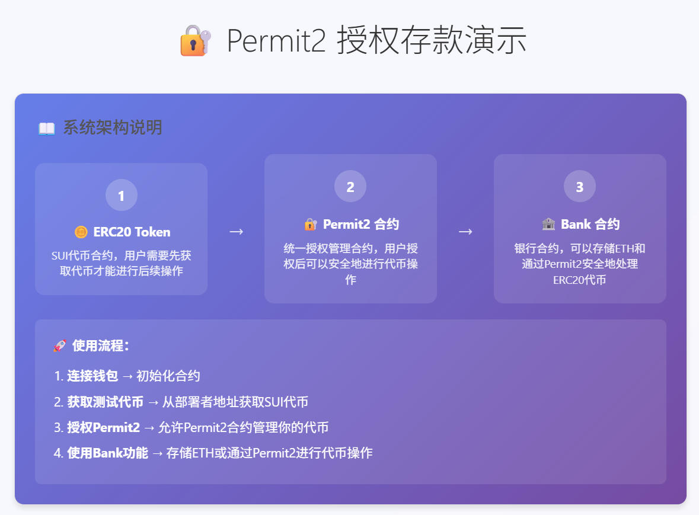
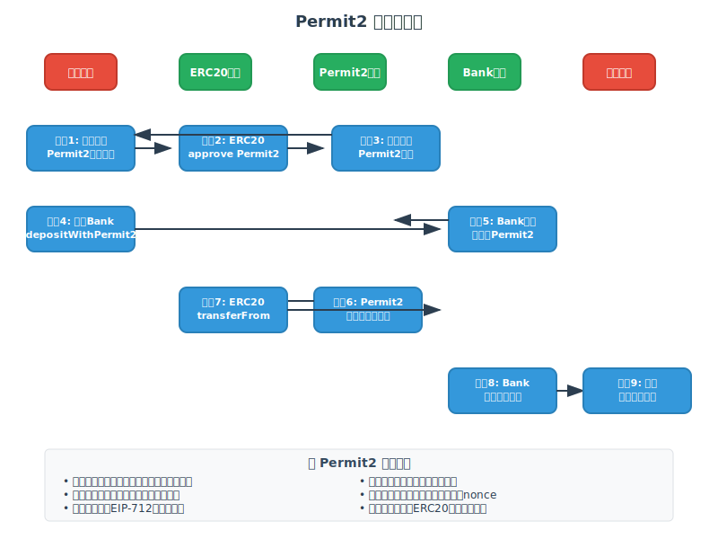
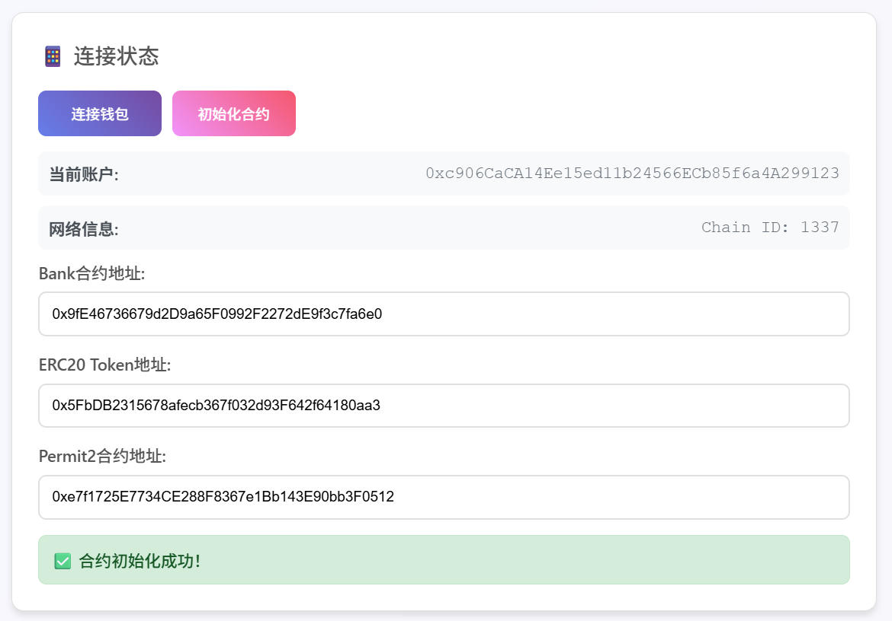
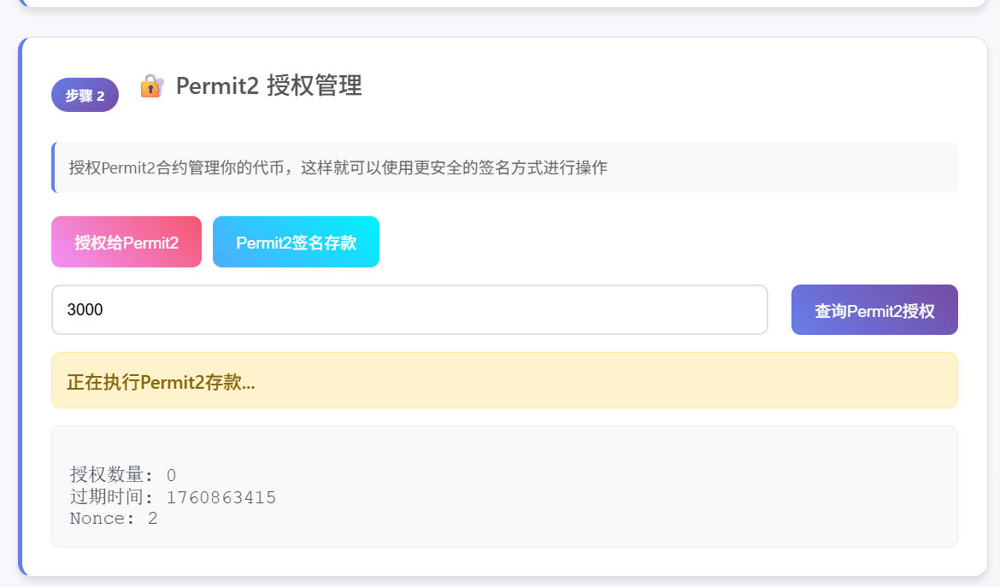
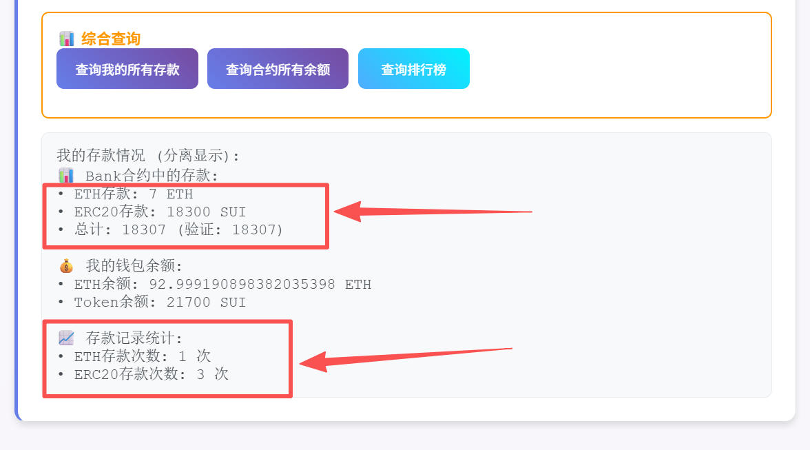

# 🏦 Permit2 银行合约项目

基于 Foundry 开发的 DeFi 项目，实现支持 Permit2 签名授权的银行合约系统。

## 📋 项目概述

展示如何使用 Permit2 协议实现无需预先授权的代币转账，包含：

- **ERC20 代币合约**：支持 EIP-2612 Permit 的 SUI Token
- **Permit2 合约**：Uniswap Permit2 协议实现
- **Bank 合约**：支持 ETH 存取款和 Permit2 代币存款
- **前端界面**：完整的 Web3 交互界面，支持 ETH 和 ERC20 分离显示



## 🏗️ 项目结构

```
permit2/
├── contracts/           # 智能合约
│   ├── Bank.sol        # 银行合约
│   ├── ERC20.sol       # SUI Token 合约
│   ├── Permit2.sol     # Permit2 协议合约
│   └── IPermit2.sol    # Permit2 接口
├── test/               # 测试文件
├── script/             # 部署脚本
└── index.html          # 完整的前端测试界面
```

## ✨ 核心功能

### 智能合约功能
- **ERC20 Token**：标准功能 + EIP-2612 Permit 签名授权
- **Permit2 协议**：批量授权、时间限制、防重放攻击
- **Bank 合约**：ETH 存取款、Permit2 代币存款、存款排行榜

### 前端界面功能
- **钱包连接**：MetaMask 钱包集成
- **代币管理**：获取、铸造、转账 ERC20 代币
- **Permit2 授权**：安全的签名授权机制
- **银行操作**：
  - ETH 存款/提款（分离显示）
  - ERC20 存款（通过 Permit2）
  - 存款查询（支持 ETH 和 ERC20 分离显示）
  - 合约余额查询
  - 存款排行榜查询

## 🎯 特色功能

### ETH 和 ERC20 分离显示
通过事件日志分析，实现了 ETH 和 ERC20 存款的精确分离显示：
- **ETH 存款**：通过 `Deposit` 事件追踪
- **ERC20 存款**：通过 `DepositWithPermit2` 事件追踪
- **综合查询**：同时显示银行存款和钱包余额

### 安全的 Permit2 机制
- 无需预先授权即可进行代币转账
- 支持批量操作和时间限制
- 防重放攻击保护

## 🔧 Permit2 实现原理详解

### 📖 什么是 Permit2？

Permit2 是由 Uniswap 团队开发的一个通用签名授权协议，它解决了传统 ERC20 代币转账需要两步操作（先 approve 再 transferFrom）的问题。通过 Permit2，用户只需要一次签名就能完成代币的授权和转账操作。

### 🏗️ 核心架构

Permit2 协议主要包含以下几个核心组件：

#### 1. **Permit2 合约**
- 作为代币授权的中介合约
- 管理用户的代币授权权限
- 验证用户签名的有效性
- 执行代币转账操作

#### 2. **EIP-712 签名标准**
- 使用结构化数据签名
- 提供人类可读的签名内容
- 防止签名重放攻击

#### 3. **Nonce 机制**
- 每个签名都有唯一的 nonce 值
- 防止签名被重复使用
- 支持批量操作的原子性

### 🔄 工作流程图



### 📋 详细工作流程

#### 第一阶段：初始化授权
1. **用户授权 Permit2**：用户需要先授权 Permit2 合约管理自己的 ERC20 代币
2. **ERC20 approve**：ERC20 合约记录 Permit2 有权限转移用户的代币

#### 第二阶段：签名授权
3. **生成 Permit2 消息**：前端构造包含转账信息的结构化消息
4. **用户签名**：用户使用私钥对消息进行 EIP-712 签名
5. **签名验证**：Permit2 合约验证签名的有效性和权限

#### 第三阶段：执行转账
6. **调用目标合约**：用户调用目标合约（如 Bank）的相关方法
7. **Permit2 验证**：目标合约调用 Permit2 进行权限验证
8. **执行转账**：Permit2 调用 ERC20 的 transferFrom 完成代币转移
9. **更新状态**：目标合约更新相关状态，前端更新显示

### 🎭 生活化比喻：银行转账的演进

让我们用银行转账的例子来理解 Permit2 的工作原理：

#### 传统 ERC20 转账 = 传统银行转账
```
👤 小明想给银行存钱：
1. 先去银行柜台填写"授权书"（approve）
2. 等待银行处理授权（等待交易确认）
3. 再填写"转账单"进行实际转账（transferFrom）
4. 等待转账完成（再次等待交易确认）

❌ 问题：需要跑两次银行，费时费力费钱
```

#### Permit2 转账 = 现代手机银行
```
👤 小明想给银行存钱：
1. 在手机上填写转账信息
2. 用指纹/面部识别签名确认（EIP-712 签名）
3. 银行自动验证身份和权限（Permit2 验证）
4. 一步完成转账（一次交易完成所有操作）

✅ 优势：一步到位，省时省力省钱
```

#### 更深入的比喻：委托代理机制

**Permit2 就像一个"超级代理人"**：

```
🏦 传统方式：
小明 → 直接去银行 → 银行处理

🤝 Permit2 方式：
小明 → 签署委托书给代理人(Permit2) → 代理人去银行办事 → 银行处理

代理人的优势：
• 一次委托，多次使用
• 批量处理多个业务
• 专业高效，减少出错
• 24小时服务，随时可用
```

### 🔐 安全机制详解

#### 1. **EIP-712 结构化签名**
```solidity
struct PermitTransferFrom {
    TokenPermissions permitted;  // 代币和数量
    address spender;            // 授权对象
    uint256 nonce;             // 防重放
    uint256 deadline;          // 过期时间
}
```

#### 2. **时间限制机制**
- 每个签名都有 `deadline` 过期时间
- 过期签名自动失效，防止被恶意使用
- 类似于"限时优惠券"，过期作废

#### 3. **Nonce 防重放**
- 每个用户维护独立的 nonce 计数器
- 每次签名使用后 nonce 自动递增
- 防止同一个签名被多次使用

#### 4. **权限精确控制**
- 可以精确指定代币类型和数量
- 可以指定特定的接收合约
- 避免过度授权的安全风险

### 💡 技术优势总结

| 特性 | 传统 ERC20 | Permit2 |
|------|------------|---------|
| 交易次数 | 2次（approve + transferFrom） | 1次 |
| Gas 费用 | 高（两次交易） | 低（一次交易） |
| 用户体验 | 复杂（需要等待两次确认） | 简单（一次签名） |
| 安全性 | 基础 | 增强（时间限制、nonce） |
| 批量操作 | 不支持 | 原生支持 |
| 授权管理 | 永久授权风险 | 精确控制 |

### 🎯 实际应用场景

1. **DeFi 协议集成**：DEX、借贷平台、流动性挖矿
2. **批量操作**：一次签名完成多个代币的操作
3. **移动端 DApp**：减少用户操作步骤，提升体验
4. **企业级应用**：批量工资发放、供应链支付

## 🚀 快速开始

### 环境要求
- [Foundry](https://book.getfoundry.sh/getting-started/installation)
- [MetaMask](https://metamask.io/) 钱包
- Python 3.x（用于启动本地服务器）

### 使用步骤
```bash
# 1. 克隆项目
git clone <repository-url>
cd permit2

# 2. 安装依赖
forge install

# 3. 编译合约
forge build

# 4. 运行测试
forge test -vv

# 5. 启动本地网络
anvil --chain-id 1337 --host 0.0.0.0 --port 8545

# 6. 部署合约（新终端）
forge script script/Deploy.s.sol --rpc-url http://localhost:8545 --broadcast

# 7. 启动前端服务
python -m http.server 8080

# 8. 访问前端界面
# 浏览器打开: http://localhost:8080
```

## 📊 合约地址 (本地网络部署后会显示)

```
ERC20Token:  0x5FbDB2315678afecb367f032d93F642f64180aa3
Permit2:     0xe7f1725E7734CE288F8367e1Bb143E90bb3F0512
Bank:        0x9fE46736679d2D9a65F0992F2272dE9f3c7fa6e0
```

## 🔧 使用指南


### 1. 连接钱包
- 点击"连接 MetaMask"按钮
- 确保钱包连接到本地网络（Chain ID: 1337）




### 2. 获取测试代币
- 在"获取 ERC20代币"区域铸造 SUI Token
- 建议铸造 10000 个代币用于测试


### 3. Permit2 授权
- 授权 Permit2 合约管理你的代币
- 查询当前授权状态



### 4. 银行操作
- **ETH 存款**：直接存入 ETH 到银行合约
- **ERC20 存款**：使用 Permit2 签名机制存入代币
- **查询功能**：
  - 查询我的 ETH 存款
  - 查询我的 ERC20 存款
  - 查询我的所有存款（分离显示）
  - 查询合约余额
  - 查询存款排行榜




## 📝 更新日志

### v2.0.0 (最新)
- ✅ 实现 ETH 和 ERC20 存款分离显示
- ✅ 通过事件日志精确追踪存款记录
- ✅ 优化前端界面布局和用户体验
- ✅ 完善查询功能，支持综合显示
- ✅ 移动 Permit2 授权查询按钮到合适位置

### v1.0.0
- ✅ 基础 Permit2 银行合约实现
- ✅ ERC20 代币和 Permit2 集成
- ✅ 前端 Web3 交互界面