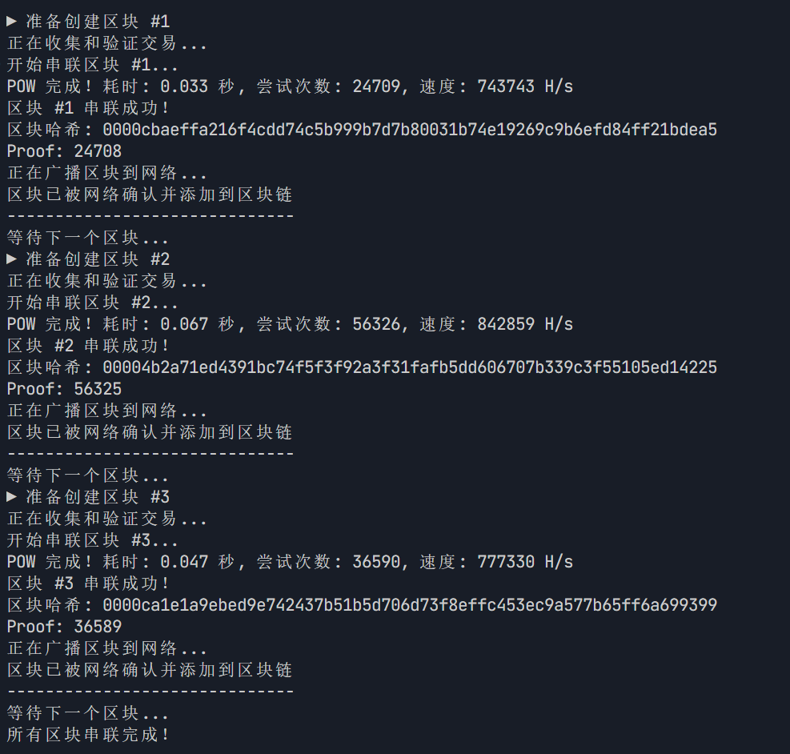
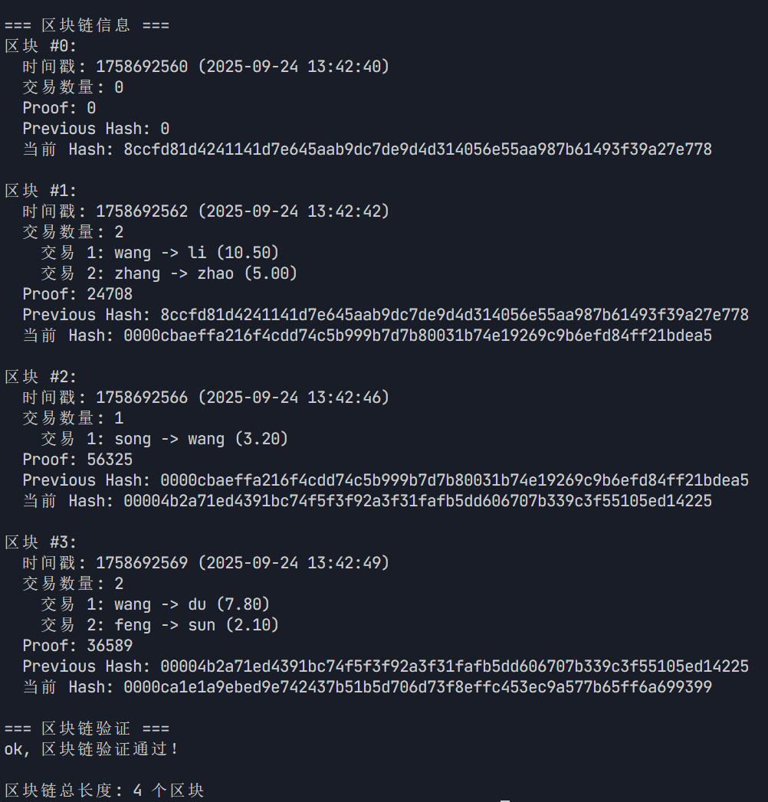

# 最小区块链实现

Go 语言实现的最小区块链演示程序，包含了区块链的核心功能：工作量证明（POW）和区块链接。程序模拟了真实区块链的流程。

## 功能特性

- ✅ **POW 工作量证明**：难度为 4 个前导 0 的哈希值
- ✅ **区块链接**：每个区块通过 `previous_hash` 与前一个区块链接
- ✅ **交易系统**：支持简单的转账交易
- ✅ **区块链验证**：验证整个区块链的完整性和有效性
- ✅ **串联统计**：显示串联耗时、尝试次数和算力
- ✅ **真实时间流程**：模拟交易收集、串联、广播和确认的完整过程

## 区块结构

每个区块包含以下字段：

```json
{
  "index": 1,
  "timestamp": 1506057125,
  "transactions": [
    {
      "sender": "user1",
      "recipient": "user2",
      "amount": 10.5
    }
  ],
  "proof": 324984774000,
  "previous_hash": "0000abcd1234..."
}
```

## 运行方式

### 从 powLabs 目录运行

```bash
cd powLabs
go run simple-blockchain/block_chain.go
```

### 从项目根目录运行

```bash
go run powLabs/simple-blockchain/block_chain.go
```

或者使用 Go 1.20+ 的 `-C` 参数：

```bash
go -C powLabs run simple-blockchain/block_chain.go
```

## 程序输出示例

```
▶ 准备创建区块 #1
正在收集和验证交易...
开始串联区块 #1...
POW 完成！耗时: 0.033 秒, 尝试次数: 24709, 速度: 743743 H/s
区块 #1 串联成功！
区块哈希: 0000cbaeffa216f4cdd74c5b999b7d7b80031b74e19269c9b6efd84ff21bdea5       
Proof: 24708
正在广播区块到网络...
区块已被网络确认并添加到区块链
------------------------------
等待下一个区块.........
所有区块串联完成！
```




```
=== 区块链信息 ===
区块 #1:
  时间戳: 1758692562 (2025-09-24 13:42:42)
  交易数量: 2
    交易 1: wang -> li (10.50)
    交易 2: zhang -> zhao (5.00)
  Proof: 24708
  Previous Hash: 8ccfd81d4241141d7e645aab9dc7de9d4d314056e55aa987b61493f39a27e778
  当前 Hash: 0000cbaeffa216f4cdd74c5b999b7d7b80031b74e19269c9b6efd84ff21bdea5
......
=== 区块链验证 ===
ok, 区块链验证通过！
```



## 时间流程模拟

程序模拟了真实区块链的以下时间节点：

1. **交易收集和验证**：1 秒 - 模拟收集交易池中的交易并验证
2. **POW 挖矿过程**：实际计算时间 - 寻找满足难度的 proof 值
3. **区块广播**：0.5 秒 - 模拟向网络广播新区块
4. **网络确认**：即时 - 模拟网络节点确认区块
5. **区块间隔**：2 秒 - 模拟真实区块链的出块间隔

## 

### 工作量证明（POW）

程序使用 SHA-256 哈希算法，寻找满足以下条件的 `proof` 值：

```
SHA-256(区块数据 + proof) 的结果以 "0000" 开头
```

### 区块链接

每个新区块的 `previous_hash` 字段存储前一个区块的完整哈希值，确保区块链的完整性。
