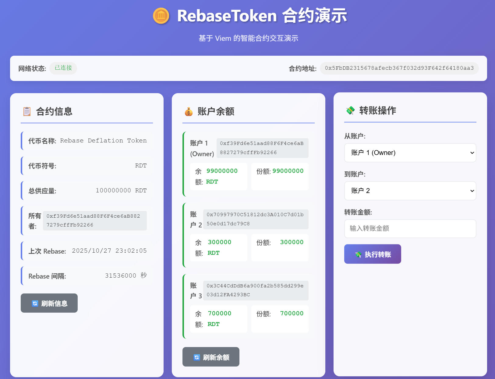
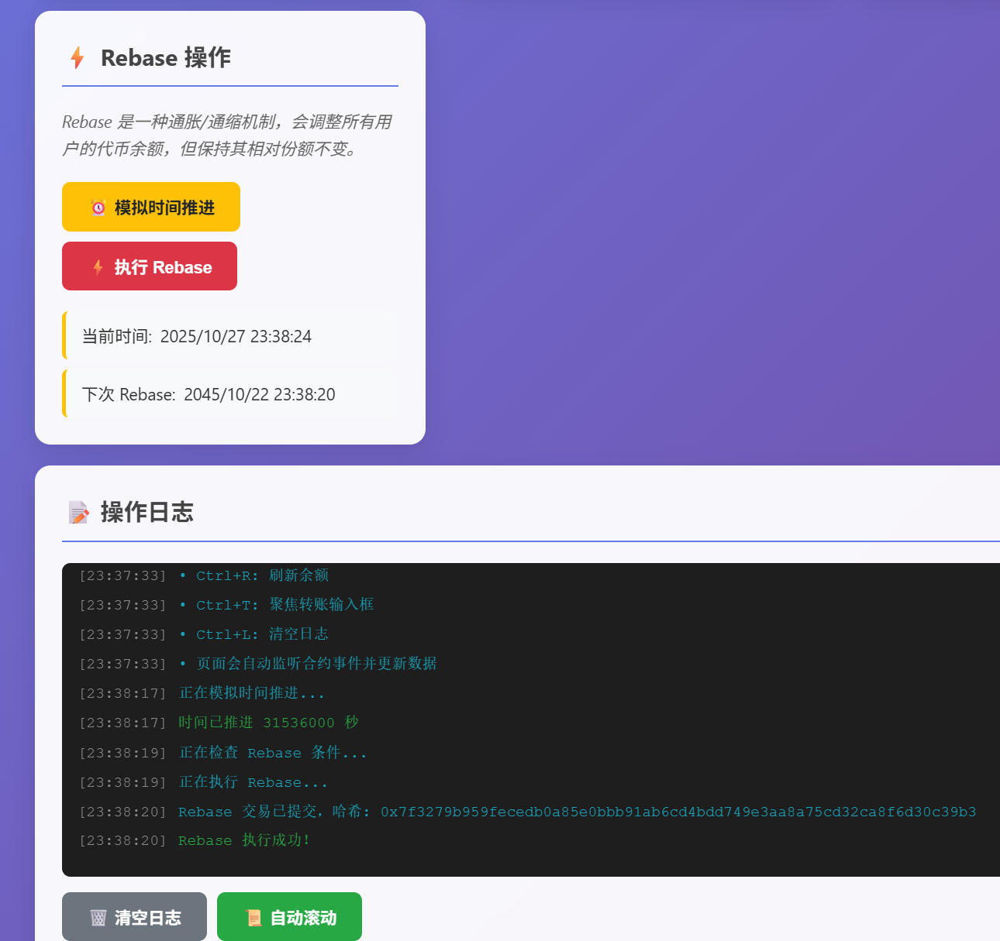
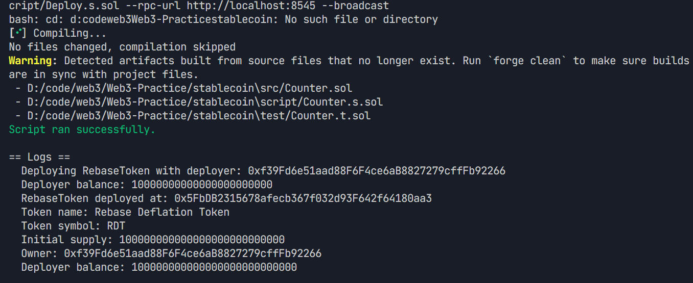
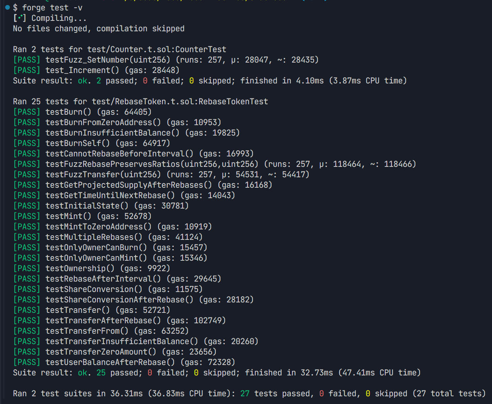
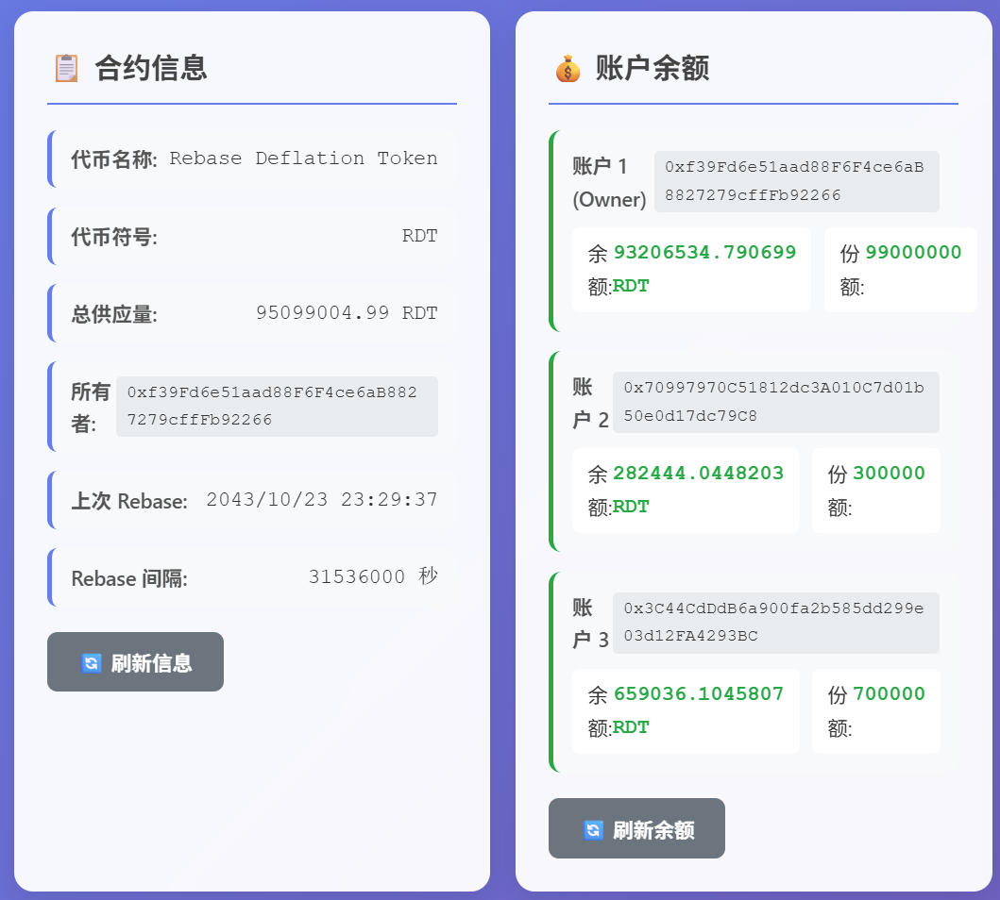

# Rebase Deflation Token (RDT)

基于 Solidity 0.8.25 和 Foundry 框架实现的通缩型 Rebase Token 合约，配备现代化的 Web 前端界面。

## 项目概述

本项目实现了一个具有以下特性的 ERC-20 代币：
- **通缩机制**：每年减少 1% 的总供应量
- **Rebase 机制**：通过份额系统维持用户持币比例不变
- **定时触发**：每年可触发一次 rebase 操作
- **安全性**：包含重入保护、权限控制等安全机制
- **Web 界面**：提供直观的前端交互界面



## 项目结构

```
stablecoin/
├── src/                    # 合约源码
│   ├── RebaseToken.sol    # 主合约
│   └── IRebaseToken.sol   # 接口定义
├── test/                  # 测试文件
│   └── RebaseToken.t.sol  # 合约测试
├── script/                # 部署脚本
│   └── Deploy.s.sol       # 部署脚本
├── lib/                   # 依赖库
├── broadcast/             # 部署记录
├── index.html            # 前端主页面
├── app.js                # 前端逻辑
├── styles.css            # 样式文件
├── DESIGN.md             # 设计文档
└── README.md             # 项目文档
```

## 

## 核心特性

### 1. 通缩机制
- 初始供应量：100,000,000 RDT
- 年通缩率：1%（每次 rebase 后总供应量变为原来的 99%）
- 触发间隔：365 天

### 2. 份额系统
- 用户持有的是份额（shares），而不是直接的代币数量
- `balanceOf()` 返回基于份额计算的实际代币余额
- Rebase 后份额不变，但每个份额对应的代币数量会减少

### 3. 主要函数
- `rebase()`：执行通缩操作（仅在间隔期后可调用）
- `sharesOf(address)`：查询用户持有的份额数量
- `getSharesByAmount(uint256)`：将代币数量转换为份额
- `getAmountByShares(uint256)`：将份额转换为代币数量
- `canRebase()`：检查是否可以执行 rebase
- `getTimeUntilNextRebase()`：获取距离下次 rebase 的时间

### 4. Web 前端特性
- **实时数据显示**：合约信息、账户余额、Rebase 状态
- **动态时间更新**：实时显示当前时间和下次 Rebase 时间
- **交互操作**：转账、Rebase 执行、时间模拟
- **事件监听**：自动监听合约事件并更新界面
- **操作日志**：详细记录所有操作和事件
- **响应式设计**：适配不同屏幕尺寸



## 技术实现

### 合约架构
```
RebaseToken.sol
├── 继承 ERC20（OpenZeppelin）
├── 继承 Ownable（权限控制）
├── 继承 ReentrancyGuard（重入保护）
└── 实现 IRebaseToken（自定义接口）
```

### 前端技术栈
```
Web Frontend
├── HTML5 + CSS3（响应式设计）
├── Vanilla JavaScript（ES6+）
├── Viem.js（以太坊交互库）
└── HTTP Server（本地开发服务器）
```

### 核心算法
```solidity
// 余额计算
balanceOf(user) = (shares[user] * currentTotalSupply) / totalShares

// Rebase 计算
newTotalSupply = currentTotalSupply * 99 / 100
```

## 快速开始

### 1. 环境准备
```bash
# 安装 Foundry
curl -L https://foundry.paradigm.xyz | bash
foundryup

# 安装 Node.js（用于前端服务器）
# 访问 https://nodejs.org/ 下载安装
```

### 2. 项目设置
```bash
# 克隆项目
git clone <repository>
cd stablecoin

# 安装 Foundry 依赖
forge install

# 安装前端依赖（可选）
npm install -g http-server
```

### 3. 启动开发环境
```bash
# 终端 1：启动本地区块链
anvil

# 终端 2：部署合约
forge script script/Deploy.s.sol --rpc-url http://localhost:8545 --private-key 0xac0974bec39a17e36ba4a6b4d238ff944bacb478cbed5efcae784d7bf4f2ff80 --broadcast

# 终端 3：启动前端服务器
npx http-server -p 3000 --cors
```

### 4. 访问应用
打开浏览器访问：`http://localhost:3000`

## 部署和使用



### 编译合约
```bash
forge build
```

### 运行测试
```bash
# 运行所有测试
forge test

# 运行详细测试
forge test -vv

# 运行特定测试
forge test --match-test testRebase
```




### 部署合约

#### 本地部署（推荐用于开发）
```bash
# 启动本地节点
anvil

# 部署到本地网络
forge script script/Deploy.s.sol --rpc-url http://localhost:8545 --private-key 0xac0974bec39a17e36ba4a6b4d238ff944bacb478cbed5efcae784d7bf4f2ff80 --broadcast
```

#### 测试网部署
```bash
# 配置环境变量
cp .env.example .env
# 编辑 .env 文件，填入你的私钥和 RPC URL

# 部署到 Sepolia 测试网
forge script script/Deploy.s.sol --rpc-url $SEPOLIA_RPC_URL --private-key $PRIVATE_KEY --broadcast --verify
```

### 前端配置

如果部署到不同的网络或合约地址发生变化，需要更新前端配置：

1. 编辑 `app.js` 文件
2. 修改以下常量：
```javascript
const CONTRACT_ADDRESS = '0x5FbDB2315678afecb367f032d93F642f64180aa3'; // 你的合约地址
const RPC_URL = 'http://localhost:8545'; // 你的 RPC URL
```

## Web 界面功能



### 主要功能模块

1. **网络状态**
   - 显示连接状态和合约地址
   - 实时网络连接检查

2. **合约信息**
   - 代币名称、符号、总供应量
   - 总份额数、上次 Rebase 时间、Rebase 间隔

3. **账户余额**
   - 多账户余额显示
   - 代币余额和份额数量
   - 实时更新

4. **转账功能**
   - 账户间转账
   - 实时余额验证
   - 交易状态反馈

5. **Rebase 操作**
   - 当前时间实时显示
   - 下次 Rebase 时间计算
   - 时间模拟功能
   - Rebase 执行

6. **操作日志**
   - 详细操作记录
   - 事件监听日志
   - 自动滚动功能

### 键盘快捷键
- `Ctrl+R`：刷新余额
- `Ctrl+T`：聚焦转账输入框
- `Ctrl+L`：清空日志

## 测试覆盖

项目包含全面的测试用例：

### 基础功能测试
- ✅ 初始状态验证
- ✅ 所有权管理
- ✅ 份额转换功能

### 转账功能测试
- ✅ 基础转账（transfer/transferFrom）
- ✅ Rebase 后转账
- ✅ 边界条件测试

### Rebase 机制测试
- ✅ 时间间隔检查
- ✅ 单次 Rebase 验证
- ✅ 多次 Rebase 验证
- ✅ 用户余额比例保持

### 铸造和销毁测试
- ✅ 铸造功能
- ✅ 销毁功能
- ✅ 权限控制

### 模糊测试
- ✅ 随机金额转账测试
- ✅ Rebase 比例保持测试

### 前端集成测试
- ✅ 合约交互功能
- ✅ 事件监听机制
- ✅ 实时数据更新
- ✅ 用户界面响应

## 安全考虑

### 合约安全
1. **重入保护**：使用 OpenZeppelin 的 ReentrancyGuard
2. **权限控制**：铸造和销毁功能仅限所有者
3. **时间安全**：Rebase 操作有时间间隔限制
4. **精度处理**：使用高精度计算避免舍入误差
5. **零地址检查**：防止向零地址转账或铸造

### 前端安全
1. **私钥管理**：使用预定义的测试私钥，仅用于开发环境
2. **输入验证**：前端进行基础的输入验证
3. **错误处理**：完善的错误捕获和用户提示
4. **CORS 配置**：开发服务器启用 CORS 支持

## 故障排除

### 常见问题

1. **合约调用失败**
   - 检查 Anvil 是否正在运行
   - 确认合约是否已正确部署
   - 验证合约地址是否正确

2. **前端无法连接**
   - 确认 HTTP 服务器正在运行
   - 检查端口 3000 是否被占用
   - 清除浏览器缓存

3. **时间显示异常**
   - 刷新页面重新初始化
   - 检查浏览器控制台错误信息

4. **Rebase 无法执行**
   - 确认时间间隔是否已满足
   - 使用"模拟时间推进"功能
   - 检查账户权限

### 调试技巧

1. **查看合约事件**
```bash
# 使用 cast 查看事件日志
cast logs --rpc-url http://localhost:8545 --address <CONTRACT_ADDRESS>
```

2. **检查账户余额**
```bash
# 查看 ETH 余额
cast balance <ACCOUNT_ADDRESS> --rpc-url http://localhost:8545

# 查看代币余额
cast call <CONTRACT_ADDRESS> "balanceOf(address)" <ACCOUNT_ADDRESS> --rpc-url http://localhost:8545
```

3. **浏览器调试**
   - 打开开发者工具（F12）
   - 查看 Console 标签页的日志信息
   - 检查 Network 标签页的请求状态

## 事件日志

合约会发出以下事件：
- `Rebase(uint256 newTotalSupply, int256 supplyDelta)`：Rebase 执行时
- `SharesTransfer(address from, address to, uint256 shares)`：份额转移时
- `Transfer(address from, address to, uint256 value)`：标准 ERC20 转账事件

## 贡献指南

1. Fork 本项目
2. 创建功能分支 (`git checkout -b feature/AmazingFeature`)
3. 提交更改 (`git commit -m 'Add some AmazingFeature'`)
4. 推送到分支 (`git push origin feature/AmazingFeature`)
5. 开启 Pull Request

## 许可证

MIT License
