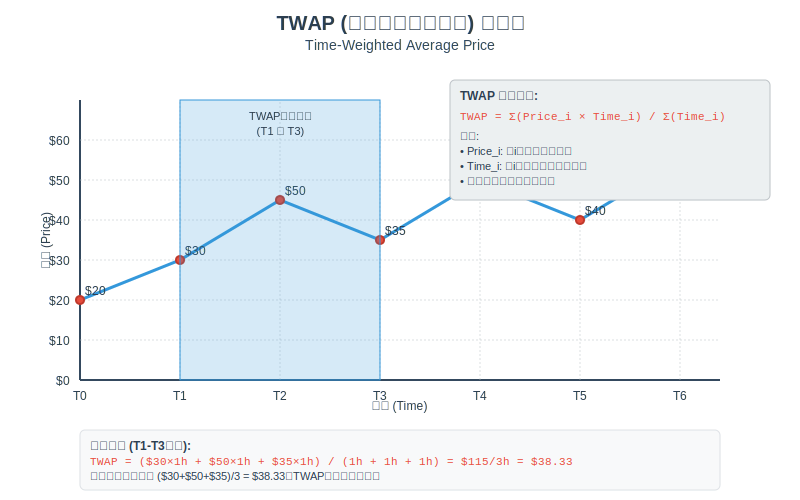
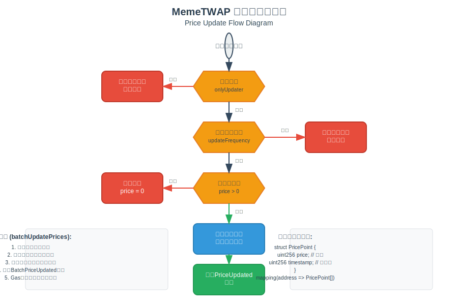
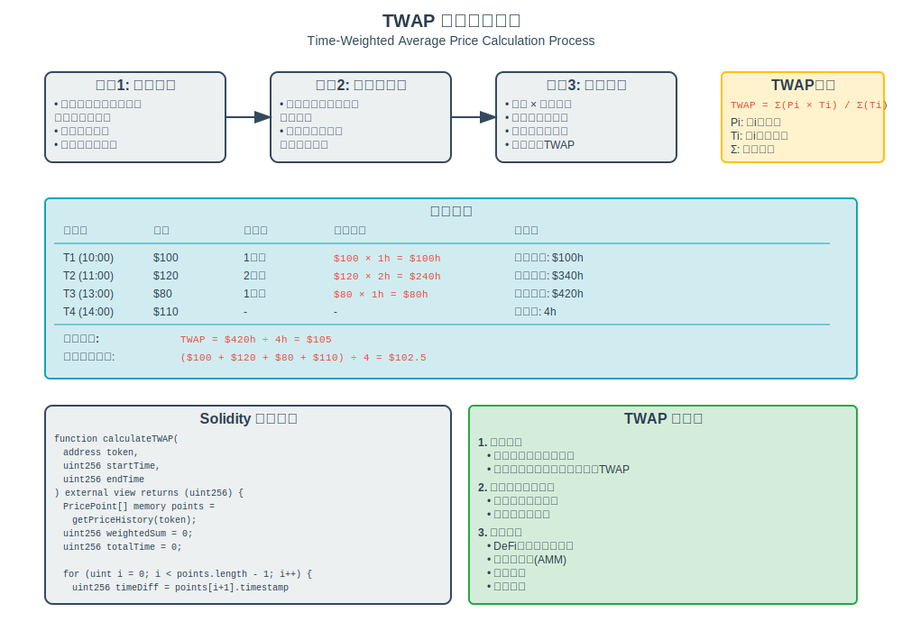
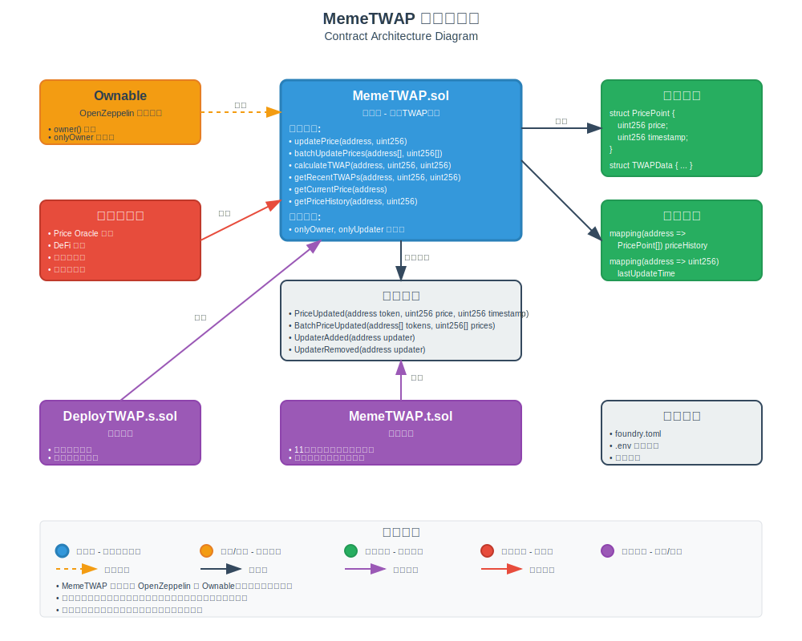

# MemeTWAP - 时间加权平均价格合约

## 📖 项目简介

MemeTWAP 是一个专门为 **[Meme](https://github.com/lookteas/Web3-Practice/tree/main/launchPad)** 代币提供时间加权平均价格（TWAP）计算服务。该合约能够跟踪多个代币的价格历史，并提供准确的 TWAP 计算功能。

## ✨ 主要功能

- **价格更新**: 支持单个和批量价格更新
- **TWAP计算**: 提供精确的时间加权平均价格计算
- **历史数据**: 维护完整的价格历史记录
- **访问控制**: 基于角色的权限管理
- **频率限制**: 防止价格操纵的更新频率控制
- **批量操作**: 支持多代币批量价格更新

## 📊 TWAP 实现原理图解

为了更好地理解 TWAP（时间加权平均价格）的实现原理，请参考以下详细的图解说明：

### 1. TWAP 概念解释



TWAP（Time-Weighted Average Price）是一种计算资产在特定时间段内平均价格的方法。与简单平均价格不同，TWAP 考虑了每个价格点持续的时间长度，为持续时间更长的价格赋予更大的权重。

**核心公式**：

```
TWAP = Σ(价格i × 持续时间i) / 总时间
```

### 2. 价格更新流程



价格更新是 TWAP 系统的核心功能，包含以下关键步骤：

1. **权限验证**：确保只有授权用户可以更新价格
2. **频率检查**：防止过于频繁的价格更新
3. **数据验证**：验证价格数据的有效性
4. **存储更新**：将新价格点添加到历史记录
5. **事件发出**：通知外部系统价格已更新

### 3. TWAP 计算过程



TWAP 计算是一个复杂的过程，涉及多个步骤：

1. **数据收集**：获取指定时间段内的所有价格点
2. **时间分段**：计算每个价格点的持续时间
3. **加权计算**：根据持续时间计算加权价格
4. **结果汇总**：得出最终的 TWAP 值

**实际计算示例**：
- 价格 $100 持续 2 小时 = $200 小时
- 价格 $120 持续 1 小时 = $120 小时  
- 价格 $110 持续 1 小时 = $110 小时
- TWAP = ($200 + $120 + $110) ÷ 4 小时 = $107.5

### 4. 合约架构图



合约架构展示了 MemeTWAP 系统的完整结构：

- **主合约**：MemeTWAP.sol 包含所有核心功能
- **继承关系**：继承 OpenZeppelin 的 Ownable 提供访问控制
- **数据存储**：使用映射存储价格历史和相关数据
- **外部交互**：支持多种外部系统的调用
- **事件系统**：完整的事件记录机制

## 🏗️ 合约架构

### 核心合约

- **MemeTWAP.sol**: 主合约，实现所有TWAP相关功能
- **DeployTWAP.s.sol**: 部署脚本

### 主要组件

```solidity
struct PricePoint {
    uint256 price;      // 价格
    uint256 timestamp;  // 时间戳
}

struct TWAPData {
    uint256 twap;       // TWAP值
    uint256 startTime;  // 开始时间
    uint256 endTime;    // 结束时间
    uint256 dataPoints; // 数据点数量
}
```

## 🚀 快速开始

### 环境要求

- Node.js >= 16.0.0
- Foundry
- Git

### 安装依赖

```bash
# 克隆项目
git clone <repository-url>
cd twap

# 安装 Foundry 依赖
forge install

# 复制环境变量文件
cp .env.example .env
```

### 配置环境变量

编辑 `.env` 文件：

```bash
# 私钥（用本地于部署）
PRIVATE_KEY=0xac0974bec39a17e36ba4a6b4d238ff944bacb478cbed5efcae784d7bf4f2ff80  （本地测试钱包，生产环境请勿填写）

# RPC URL
RPC_URL=http://localhost:8545

# Etherscan API Key（可选）
ETHERSCAN_API_KEY=your_etherscan_api_key

# 合约地址
MEME_FACTORY_ADDRESS=0x1234567890123456789012345678901234567890
```

## 🔧 开发指南

### 编译合约

```bash
forge build
```

### 运行测试

```bash
# 运行所有测试
forge test

# 运行详细测试
forge test -vv

# 运行特定测试
forge test --match-test testBasicPriceUpdate
```

### 部署合约

#### 本地部署

1. 启动本地节点：
```bash
anvil
```

2. 部署合约：
```bash
forge script script/DeployTWAP.s.sol --rpc-url http://localhost:8545 --private-key 0xac0974bec39a17e36ba4a6b4d238ff944bacb478cbed5efcae784d7bf4f2ff80 --broadcast
```

#### 测试网部署

```bash
forge script script/DeployTWAP.s.sol --rpc-url $RPC_URL --private-key $PRIVATE_KEY --broadcast --verify
```

## 📋 API 文档

### 主要函数

#### 价格更新

```solidity
// 更新单个代币价格
function updatePrice(address token, uint256 price) external onlyUpdater

// 批量更新价格
function batchUpdatePrices(address[] calldata tokens, uint256[] calldata prices) external onlyUpdater
```

#### TWAP计算

```solidity
// 计算指定时间段的TWAP
function calculateTWAP(address token, uint256 startTime, uint256 endTime) external view returns (uint256)

// 获取最近的TWAP数据
function getRecentTWAPs(address token, uint256 periods, uint256 periodDuration) external view returns (TWAPData[] memory)
```

#### 数据查询

```solidity
// 获取当前价格
function getCurrentPrice(address token) external view returns (uint256)

// 获取价格历史
function getPriceHistory(address token, uint256 limit) external view returns (PricePoint[] memory)
```

## 🧪 测试覆盖

项目包含全面的测试套件，覆盖以下场景：

- ✅ 基本价格更新
- ✅ 批量价格更新  
- ✅ TWAP计算准确性
- ✅ 边界条件处理
- ✅ 访问控制验证
- ✅ 频率限制测试
- ✅ 大规模数据处理
- ✅ 长期TWAP计算
- ✅ 多代币支持
- ✅ 模糊测试
- ✅ 无效输入处理

### 测试结果

```
Ran 11 tests for test/MemeTWAP.t.sol:MemeTWAPTest
[PASS] testBasicPriceUpdate() (gas: 126438)
[PASS] testBatchPriceUpdate() (gas: 248024)
[PASS] testEdgeCaseTWAP() (gas: 130363)
[PASS] testFuzzPrices(uint256) (runs: 257, μ: 127942, ~: 127942)
[PASS] testInvalidInputs() (gas: 12462)
[PASS] testLargeScalePriceUpdates() (gas: 1199016)
[PASS] testLongTermTWAP() (gas: 972413)
[PASS] testMultipleTimePointsAndTWAP() (gas: 365840)
[PASS] testMultipleTokensTWAP() (gas: 392099)
[PASS] testRecentTWAPs() (gas: 455722)
[PASS] testUpdateFrequencyLimit() (gas: 200757)

Suite result: ok. 11 passed; 0 failed; 0 skipped
```

## 📁 项目结构

```
twap/
├── src/
│   └── MemeTWAP.sol          # 主合约
├── test/
│   └── MemeTWAP.t.sol        # 测试文件
├── script/
│   └── DeployTWAP.s.sol      # 部署脚本
├── lib/                      # 依赖库
├── broadcast/                # 部署记录
├── deployments/              # 部署信息
├── foundry.toml             # Foundry配置
├── .env.example             # 环境变量模板
└── README.md                # 项目文档
```

## 🔒 安全特性

- **访问控制**: 使用 OpenZeppelin 的 Ownable 模式
- **频率限制**: 防止价格操纵攻击
- **输入验证**: 严格的参数验证
- **溢出保护**: 使用 Solidity 0.8+ 内置保护
- **重入保护**: 合理的状态管理


## 🧪 时间模拟测试工具

本项目包含了完整的时间模拟测试工具,详情见[**时间模拟测试工具文档**](./时间模拟测试工具文档.md)，用于验证各种复杂交易场景下的TWAP计算准确性。

### 📋 测试工具功能

- **基础时间跳跃**：支持秒、分钟、小时、天、周的时间跳跃
- **批量操作**：支持多代币并发价格更新和时间模拟
- **复杂场景模拟**：牛市、熊市、闪崩、高频交易等11种市场场景
- **精度验证**：确保TWAP计算的数学准确性

### 🎯 支持的测试场景

| 测试类型 | 场景描述 | 验证目标 |
|---------|---------|----------|
| 时间间隔测试 | 不规则间隔、高频交易、市场时间 | 时间加权计算准确性 |
| 市场场景测试 | 牛市、熊市、横盘、闪崩恢复 | 不同市场条件下的TWAP表现 |
| 边界条件测试 | 极端时间跳跃、大数值处理 | 系统鲁棒性和稳定性 |
| 精度验证测试 | 数学计算验证、多时间框架对比 | 算法正确性和精度 |

### 📖 详细文档

完整的时间模拟测试工具使用说明请参考：[**时间模拟测试工具文档**](./时间模拟测试工具文档.md)

文档包含：
- 🛠️ 核心工具函数详解
- 📊 TWAP计算原理和公式
- 🎯 11种复杂交易场景的实现方法
- 📈 精度验证和性能分析
- 🚀 扩展功能和最佳实践

### 🏃‍♂️ 快速开始测试

```bash
# 运行所有时间模拟测试
forge test --match-test "testIrregular|testHighFrequency|testMarketHours|testBull|testBear" -vv

# 运行时间工具函数示例
forge test --match-test "testTimeUtilitiesExample|testBatchUpdateUtilities" -vv

# 运行精度验证测试
forge test --match-test "testTWAPCalculationPrecision|testBoundaryTimeTWAP" -vv
```


## 🤝 贡献指南

1. Fork 项目
2. 创建功能分支 (`git checkout -b feature/AmazingFeature`)
3. 提交更改 (`git commit -m 'Add some AmazingFeature'`)
4. 推送到分支 (`git push origin feature/AmazingFeature`)
5. 开启 Pull Request

## 📄 许可证

本项目采用 MIT 许可证 - 查看 [LICENSE](LICENSE) 文件了解详情。

## 🔗 相关链接

- [Foundry 文档](https://book.getfoundry.sh/)
- [OpenZeppelin 合约](https://docs.openzeppelin.com/contracts/)
- [Solidity 文档](https://docs.soliditylang.org/)

*本项目遵循 MIT 开源协议，欢迎贡献代码和提出改进建议！*

---

**注意**: 本项目仅用于学习和研究目的，在生产环境中使用前请进行充分的安全审计。