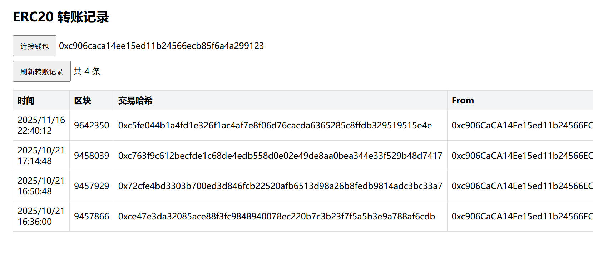
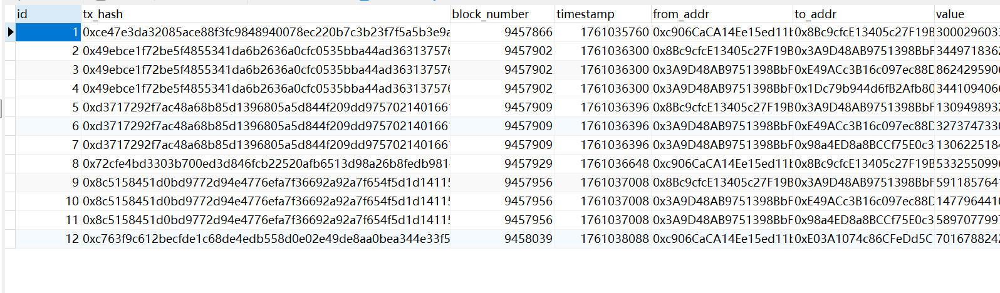
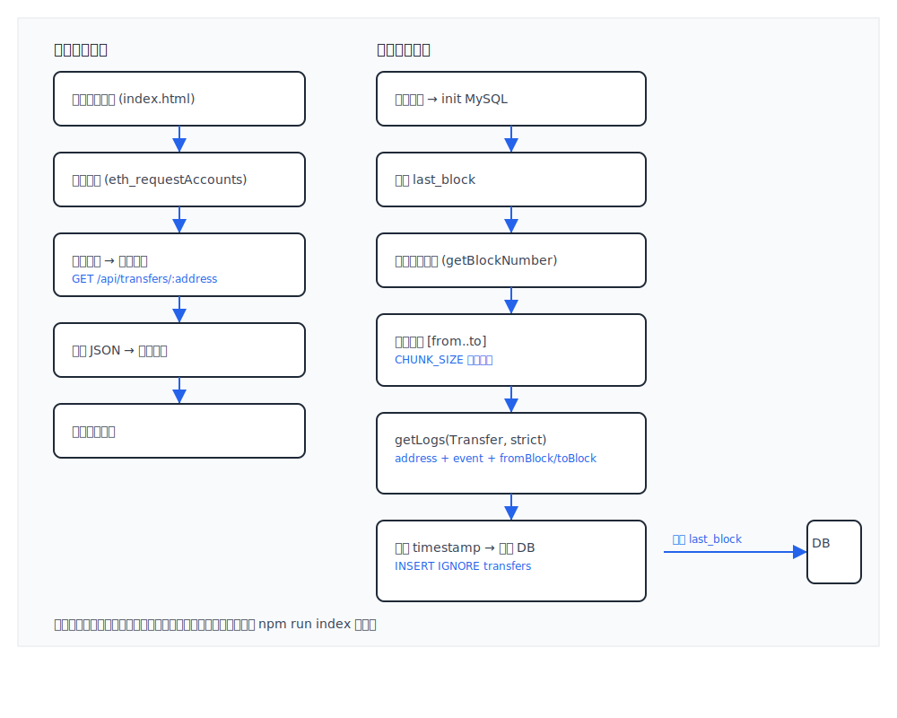

# ERC20 转账索引与展示（Viem + MySQL）

## 概述
- 本项目在 `viemIndexData` 目录下实现：
  - 使用 Viem 的 `getLogs` 按 `Transfer` 事件索引 ERC20 转账记录；
  - 将记录写入 MySQL；
  - 提供 RESTFULL 接口按地址查询转账记录；
  - 前端页面连接钱包后展示该地址的转账记录。




## 架构


- 后端：Node.js、Express、Viem、MySQL（使用 `mysql2/promise`）

- 前端：原生 HTML + JS（通过浏览器打开 `frontend/index.html`）

- 数据库：自动创建数据库与表，保存转账记录与索引进度

  




## 代码位置
- 后端服务与索引轮询：`viemIndexData/backend/src/server.js`
  - 索引循环：`viemIndexData/backend/src/server.js:27`
  - 事件抓取：`viemIndexData/backend/src/server.js:35`
  - 地址查询接口：`viemIndexData/backend/src/server.js:55`
  - 索引状态接口：`viemIndexData/backend/src/server.js:63`
  - 初始化数据库：`viemIndexData/backend/src/server.js:68`
- 一次性历史补录脚本：`viemIndexData/backend/src/indexer.js`
  - 入口：`viemIndexData/backend/src/indexer.js:34`
  - 事件抓取：`viemIndexData/backend/src/indexer.js:41`
  - 初始化数据库：`viemIndexData/backend/src/indexer.js:70`
- 数据库访问层：`viemIndexData/backend/src/db.js`
  - 初始化与建库建表：`viemIndexData/backend/src/db.js:6`
  - 写入转账：`viemIndexData/backend/src/db.js:38`
  - 查询地址记录：`viemIndexData/backend/src/db.js:45`
  - 索引进度读写：`viemIndexData/backend/src/db.js:25`、`viemIndexData/backend/src/db.js:32`
- 前端页面：`viemIndexData/frontend/index.html`、逻辑：`viemIndexData/frontend/app.js`
  - 后端地址：`viemIndexData/frontend/index.html:12`（默认 `http://localhost:3001`）

## 架构图


## 执行流程图



## 快速开始
### 前置要求
- 安装并运行 MySQL（本机或远程均可）
- 准备 RPC 与合约信息：`RPC_URL`、`TOKEN_ADDRESS`、建议的 `START_BLOCK`（合约部署区块）
- Node.js ≥ 18

### 后端安装与启动
1. 进入后端目录并安装依赖：
   - `cd viemIndexData/backend`
   - `npm install`
2. 配置环境变量：复制 `.env.example` 为 `.env` 并填入：
```
RPC_URL=你的RPC地址
TOKEN_ADDRESS=你的ERC20合约地址
START_BLOCK=合约部署区块（可选）
TOKEN_DECIMALS=18
POLL_INTERVAL_MS=15000
CHUNK_SIZE=2000
PORT=3001
MYSQL_HOST=localhost
MYSQL_PORT=3306
MYSQL_USER=root
MYSQL_PASSWORD=你的密码
MYSQL_DATABASE=viem_index
```
3. 启动服务（默认端口 `3001`）：
   - `npm start`
4. 验证索引状态：
   - `GET http://localhost:3001/api/indexing/status`

### 一次性历史补录（可选）
- 从 `START_BLOCK` 到当前区块的批量抓取：
  - `npm run index`

### 前端使用
- 直接用浏览器打开 `viemIndexData/frontend/index.html`
- 点击“连接钱包”，再点击“刷新转账记录”拉取并展示该地址的记录
- 如需更换后端地址，修改 `viemIndexData/frontend/index.html:12` 中的 `backendBase`

## 配置项说明
- `RPC_URL`：链的 RPC 地址
- `TOKEN_ADDRESS`：要索引的 ERC20 合约地址
- `START_BLOCK`：历史索引的起始区块（建议为合约部署区块）
- `TOKEN_DECIMALS`：代币精度（用于格式化返回值），默认 `18`
- `POLL_INTERVAL_MS`：轮询索引间隔，默认 `15000`
- `CHUNK_SIZE`：每次 `getLogs` 的区块跨度，默认 `2000`
- `PORT`：后端端口，默认 `3001`
- `MYSQL_HOST`、`MYSQL_PORT`、`MYSQL_USER`、`MYSQL_PASSWORD`、`MYSQL_DATABASE`：MySQL 连接配置

## 数据库模型
- 自动创建数据库与表（初始化位置：`viemIndexData/backend/src/db.js:6`）
- 表结构：
```
CREATE TABLE IF NOT EXISTS transfers (
  id INT AUTO_INCREMENT PRIMARY KEY,
  tx_hash VARCHAR(66) NOT NULL,
  block_number BIGINT NOT NULL,
  timestamp INT NOT NULL,
  from_addr VARCHAR(42) NOT NULL,
  to_addr VARCHAR(42) NOT NULL,
  value VARCHAR(78) NOT NULL,
  UNIQUE KEY unique_tx (tx_hash, from_addr, to_addr, value),
  KEY idx_addr (from_addr, to_addr)
);

CREATE TABLE IF NOT EXISTS index_state (
  id TINYINT PRIMARY KEY,
  last_block BIGINT
);
```
- 说明：
  - `transfers` 保存每笔 `Transfer` 事件，`unique_tx` 防止重复写入；
  - `index_state` 保存最后已索引区块，服务启动后继续增量索引。

## API 说明
- `GET /api/transfers/:address?limit=100`  
  
  - 参数：`address` 要查询的合约地址（/api/transfers/0xc906cacxxxxxxxxxx），`limit` 返回数量，默认 100
  - 返回字段：`txHash`、`blockNumber`、`timestamp`、`from`、`to`、`value`、`valueFormatted`
  - 实现位置：`viemIndexData/backend/src/server.js:55`
  
  ```
  {
      "address": "0xc906caca14ee15ed11b24566ecb85f6a4a299123",
      "total": 4,
      "data": [
          {
              "txHash": "0xc763f9c612becfde1c68de4edb558d0e02e49de8aa0bea344e33f529b48d7417",
              "blockNumber": 9458039,
              "timestamp": 1761038088,
              "from": "0xc906CaCA14Ee15ed11b24566ECb85f6a4A299123",
              "to": "0xE03A1074c86CFeDd5C142C4F04F1a1536e203543",
              "value": "7016788242377359249144464",
              "valueFormatted": "7016788.242377359249144464"
          },
          {
              "txHash": "0x72cfe4bd3303b700ed3d846fcb22520afb6513d98a26b8fedb9814adc3bc33a7",
              "blockNumber": 9457929,
              "timestamp": 1761036648,
              "from": "0xc906CaCA14Ee15ed11b24566ECb85f6a4A299123",
              "to": "0x8Bc9cfcE13405c27F19B588B24F4E0cc7D83230D",
              "value": "5332550996625699146592555",
              "valueFormatted": "5332550.996625699146592555"
          },
          {
              "txHash": "0xce47e3da32085ace88f3fc9848940078ec220b7c3b23f7f5a5b3e9a788af6cdb",
              "blockNumber": 9457866,
              "timestamp": 1761035760,
              "from": "0xc906CaCA14Ee15ed11b24566ECb85f6a4A299123",
              "to": "0x8Bc9cfcE13405c27F19B588B24F4E0cc7D83230D",
              "value": "3000296033864863856117153",
              "valueFormatted": "3000296.033864863856117153"
          }
      ]
  }
  ```
  
  
  
- `GET /api/indexing/status`
  
  - 返回字段：`lastIndexedBlock`、`tokenAddress`、`hasConfig`
  
  - 实现位置：`viemIndexData/backend/src/server.js:63`
  
    ```
    {
    "lastIndexedBlock": 9642283,
    "tokenAddress": "0x2fDD1d135257E3b90A92Ee94854d56AEe55a1438",
    "hasConfig": true
    }
    ```
  
    

## 索引器工作方式
- 事件定义：`Transfer(address indexed from, address indexed to, uint256 value)`，使用 `parseAbiItem`
- 事件抓取：`client.getLogs({ address, event, fromBlock, toBlock, strict: true })`
  - 地址与事件范围收敛，`strict: true` 仅返回参数完全符合 ABI 的事件；
  - 分片范围由 `CHUNK_SIZE` 控制，避免单次抓取过大；
- 时间戳：每区块调用 `getBlock` 获取 `timestamp`，并在批次内做缓存；
- 去重：依赖 `unique_tx` 约束；
- 进度：每个分片完成后更新 `index_state.last_block`；
- 参考实现位置：
  - 轮询索引：`viemIndexData/backend/src/server.js:27`
  - 一次性补录：`viemIndexData/backend/src/indexer.js:34`

## 前端说明
- 页面：`viemIndexData/frontend/index.html`
- 逻辑：`viemIndexData/frontend/app.js`
- 后端地址：`viemIndexData/frontend/index.html:12`（默认 `http://localhost:3001`）
- 展示：连接钱包后点击“刷新转账记录”，表格显示 `时间/区块/交易哈希/From/To/数量`

## 常见问题与排查
- 端口占用（`EADDRINUSE: 3001`）：
  - 查询占用：`netstat -ano | findstr :3001`
  - 释放占用（Windows PowerShell）：`Stop-Process -Id <PID> -Force`
- MySQL 连接失败：
  - 检查 `MYSQL_*` 配置；
  - 确认 MySQL 服务运行且用户有权限；
  - 默认会自动创建 `MYSQL_DATABASE` 指定的库与表。
- RPC 限流/超时：
  - 增加 `POLL_INTERVAL_MS`，降低 `CHUNK_SIZE`；
  - 选择稳定的 RPC 服务商。
- 代币精度不一致：
  - 设置 `TOKEN_DECIMALS`，服务返回的 `valueFormatted` 将按该精度格式化。

## 开发与调试
- 启动服务：`npm start`
- 一次性历史索引：`npm run index`
- 查询索引状态：`curl http://localhost:3001/api/indexing/status`
- 查询地址记录：`curl "http://localhost:3001/api/transfers/0xYourAddress?limit=20"`

## 技术说明（Viem）
- 使用 Viem 的 `getLogs` 行为：默认返回匹配事件的日志；通过 `address`、`event`、`fromBlock`、`toBlock` 收敛范围；开启 `strict` 只返回与 ABI 完全匹配的日志；`parseAbiItem` 用于从人类可读事件签名生成 ABI。

## 安全注意
- `.env` 不应提交私钥或敏感凭据；
- RPC 与数据库凭据请使用受控环境；
- 响应中不暴露任何私密信息，仅返回公共链上事件数据。
