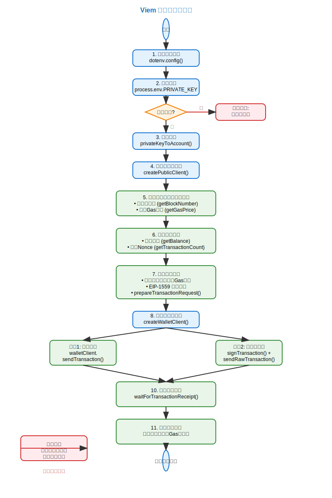

# Viem 查询 交易示例

使用 Viem 库在以太坊网络上发送交易。代码展示了完整的交易流程，从环境配置到交易确认的全过程。

## 项目结构

```
viemTokenBank/
├── demo.ts                          # 主要的交易发送示例代码
├── readme.md                        # 项目说明文档
└── transaction-flow-diagram.svg     # 交易流程图
```

## 功能特性

- ✅ 支持私钥和助记词两种账户创建方式
- ✅ 完整的网络状态检查（区块号、Gas价格、账户余额）
- ✅ EIP-1559 交易类型支持
- ✅ 两种交易发送方式：直接发送和签名后发送
- ✅ 自动Gas估算和参数优化
- ✅ 完善的错误处理机制
- ✅ 交易确认和状态监控

## 交易流程图



## 主要步骤说明

### 1. 环境准备
- 加载环境变量配置
- 验证私钥是否存在
- 创建账户对象

### 2. 网络连接
- 创建公共客户端连接到 Foundry 节点
- 检查当前区块号和网络状态
- 获取实时 Gas 价格

### 3. 账户信息查询
- 查询账户余额
- 获取当前 Nonce 值
- 确保账户有足够资金进行交易

### 4. 交易参数构建
- 设置目标地址和转账金额
- 配置 EIP-1559 Gas 参数
- 使用 `prepareTransactionRequest` 优化参数

### 5. 交易发送
提供两种发送方式：
- **方式1**: 使用 `walletClient.sendTransaction()` 直接发送
- **方式2**: 先用 `signTransaction()` 签名，再用 `sendRawTransaction()` 发送

### 6. 交易确认
- 等待交易被打包确认
- 获取交易回执信息
- 显示交易状态、区块号和 Gas 使用量

## 使用方法

1. **环境配置**
   ```bash
   # 创建 .env 文件并设置私钥
   PRIVATE_KEY=0x你的私钥
   RPC_URL=http://127.0.0.1:8545  # Foundry 本地节点
   
   # 启动foundry本地网络节点
   
   anvil --accounts 10 --balance 300   # 设置账户数为 10，账户余额为 300 ETH
   ```
   
2. **安装依赖**
   
   ```bash
   npm install viem dotenv
   ```
   
3. **运行示例**
   ```bash
   npx ts-node demo.ts
   ```

## 代码亮点

### EIP-1559 支持
```typescript
const txParams = {
  type: 'eip1559' as const,
  maxFeePerGas: gasPrice * 2n,
  maxPriorityFeePerGas: parseGwei('1.5'),
  gas: 21000n,
}
```

### 双重发送机制
```typescript
// 方式1：直接发送
const txHash1 = await walletClient.sendTransaction(preparedTx)

// 方式2：签名后发送
const signedTx = await walletClient.signTransaction(preparedTx)
const txHash = await publicClient.sendRawTransaction({
  serializedTransaction: signedTx
})
```

### 完善的错误处理
```typescript
try {
  // 交易逻辑
} catch (error) {
  console.error('错误:', error)
  if (error instanceof Error) {
    console.error('错误信息:', error.message)
  }
  throw error
}
```

## 技术栈

- **Viem**: 现代化的以太坊 TypeScript 库
- **TypeScript**: 类型安全的 JavaScript 超集
- **Foundry**: 本地以太坊开发环境
- **dotenv**: 环境变量管理

## 注意事项

1. 确保 Foundry 本地节点正在运行
2. 私钥必须对应有足够余额的账户
3. 目标地址必须是有效的以太坊地址
4. Gas 参数会根据网络状况自动调整

## 相关资源

- [Viem 官方文档](https://viem.sh/)
- [Foundry 文档](https://book.getfoundry.sh/)
- [EIP-1559 规范](https://eips.ethereum.org/EIPS/eip-1559)